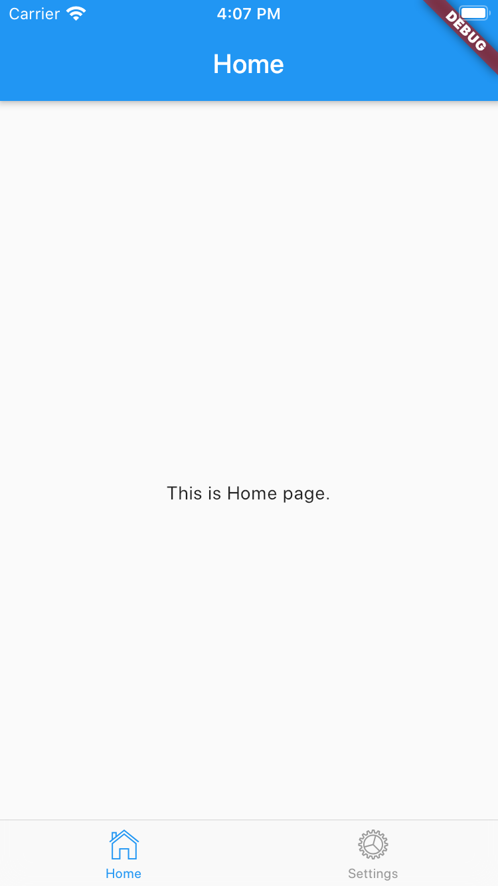

# Code flow of `to-do` app.

This is the step-by-step instructions on how to create this app from scratch.

## Table of contents.
  
1. [Prerequisites.](#Prerequisites)
1. [Creating and installing dependencies.](#Creating-and-installing-dependencies.)

## Prerequisites.

- Basic understanding of `Flutter` and `Dart`.
- Install the latest version of `Flutter` properly on your system.

## Creating and installing dependencies.

Run cmd `flutter create my_notes_flutter_mobile` to create this app.

Open `pubspec.yaml` file to include 3rd-party packages:
```yaml
...
dependencies:
  flutter:
    sdk: flutter
  provider: ^3.1.0 # The provider package for managing the state of the app.
...
```

Then run `flutter pub get` to update packages.

Open the app in `VS Code` and press `Ctrl + F5` -> Make sure you see the initial screen of flutter app with no error before moving to next step.

## Create the app's structure:

I make this app's structure similar to the `Angular` app version:
```
project
│   README.md
│   CODE_FLOW.md
│   pubspec.yaml
│
└───assets
│   
└───docs
│   │   user_manual.md
│   │
│   └───images
│       │   home_screen.png
│       │   ...
│
└───lib
│   │   app_constants.dart
│   │   app_routing.dart
│   │   main.dart
│   │   my_app.dart
│   │
│   └───components
│   │   └───login
│   │   │   │   login.dart
│   │   │   │   ...
│   │   └───home
│   │       │   home.dart
│   │       │   ...
│   │
│   └───shared
│       └───components
│       └───data
│       │   └───repositories
│       └───models
│       └───services
│   
└───test
    │   widget_test.dart
    │   widget_test2.dart
```

### Create `Home` component.

Open `main.dart` file and refactor `MyHonePage` into `Home` (in `VS Code` right-click class name and select `Rename Symbol`).

Move this `Home` component into `lib/components/home.dart` file. I prefer to set component's title inside component itself, so remove the `title` argument from its constructor:
```dart
import 'package:flutter/cupertino.dart';
import 'package:flutter/material.dart';

class Home extends StatefulWidget {
  Home({Key key}) : super(key: key);
  
  static const String title = 'Home';

  @override
  _HomeState createState() => _HomeState();
}

class _HomeState extends State<Home> {  

  @override
  Widget build(BuildContext context) {
    return Scaffold(
      appBar: AppBar(
        title: Text(Home.title),
      ),
      body: Center(
        child: Column(
          mainAxisAlignment: MainAxisAlignment.center,
          children: <Widget>[
            Text(
              'This is Home page.',
            ),
          ],
        ),
      ),
    );
  }
}
``` 

### Create `MyApp` component.

Open `main.dart` and move `MyApp` class into `my_app.dart` file.

Edit `MyHomePage` into `Home` and import the `Home` component.

**NOTE:** To avoid potential issue, you should import with the prefix `package:<path_to_component>`. For example: `import 'package:to_do_mobile_app/components/home/home.dart';`

### Modify `main.app` file.

Open `main.app` file and mark its main() function as `async`. We need this as `async` because we need have some configurations before running the app:
```dart
void main() async {
  var myApp = MyApp();
  runApp(myApp);
}
```

Now we're able to run the app using the new structure.

### Navigate with named route.

Similar to `Angular` and `React`, in `Flutter` we can show the component based on its route name. Here I'm using `onGenerateRoute` to define routes. Modify `MyApp` component as following:
```dart
class MyApp extends StatelessWidget {
  @override
  Widget build(BuildContext context) {
    return MaterialApp(
      title: 'Flutter Demo',
      theme: ThemeData(
        primarySwatch: Colors.blue,
      ),
      initialRoute: '/',
      onGenerateRoute: (RouteSettings settings) {
        switch (settings.name) {
          case '/':
            return CupertinoPageRoute(
              builder: (_) => Home(),
            );
          default:
            assert(false, 'No route defined for ${settings.name}');
            return null;
        }
      },
      // home: Home(title: 'To Do Demo'),
    );
  }
}
```

As the app gets scaled, we would have lots of routes and business logic in each route. So it's a best practice to keep your code organized by separating the routes section into another class named `AppRouting`. This approach can also be used in `Angular` and `React`. Open `app_routing.dart` file and define the following routes:
```dart
import 'package:flutter/cupertino.dart';
import 'package:to_do_mobile_app/components/home/home.dart';

class AppRouting {
    static Route<dynamic> generateAppRoute(RouteSettings settings) {
        switch (settings.name) {
          case '/':
            return CupertinoPageRoute(
              builder: (_) => Home(),
            );
          default:
            assert(false, 'No route defined for ${settings.name}');
            return null;
        }
    }
}
```

Then use this setting inside `MyApp` component as follow:
```dart
import 'package:flutter/cupertino.dart';
import 'package:flutter/material.dart';
import 'package:to_do_mobile_app/app_routing.dart';

class MyApp extends StatelessWidget {
  @override
  Widget build(BuildContext context) {
    return MaterialApp(
      title: 'Flutter Demo',
      theme: ThemeData(
        primarySwatch: Colors.blue,
      ),
      initialRoute: '/',
      onGenerateRoute: AppRouting.generateAppRoute,
      // home: Home(title: 'To Do Demo'),
    );
  }
}
```

**Best Practice:**

As you can see we use the string `/` to name the `Home` component's route in `MyApp` class, and then inside `AppRouting` class we repeat the `/` again to show the `Home` component. So it's better to put those constant values into one place, so that when we update it, it would reflect the change to all of its references. This approach also reduces the duplicated code amd makes the app more maintainable. Let's create a class named `AppConstants` in `/lib/app_constants.dart`:
```dart
import 'package:flutter/widgets.dart';

class AppConstants {
  static const String homePath = '/';
}
```

Then update the `MyApp` and `AppRouting` as follow:
```dart
#### `/lib/my_app.dart`
...
initialRoute: AppConstants.homePath,
...

#### `/lib/app_routing.dart`
switch (settings.name) {
    case AppConstants.homePath:
      return CupertinoPageRoute(
          builder: (_) => Home(),
      );
    default:
      assert(false, 'No route defined for ${settings.name}');
      return null;
}
```

## Summary.

What we have done so far:
- Structured the app's files and folders that is similar to `Angular` and `React`.
- Navigating the app using named routes.
- Put duplicated code and constants values inside `AppConstants` class.

## Bottom Navigation Bar (Tab Bar)

In this section, we're going to implement bottom navigation bar (tab bar) using Cupertino (iOS) style. -> Why not Android, but iOS style? Well, Android uses `Hierarchical Navigation` which users have to trace back to the root of the app in order to go to another tab. Imagine you're at the 5th view of the 1st tab, and in order to get to the 2nd tab, you have to press the `Back` button 5 times to get back to the root and select the 2nd tab. That's really annoying, right. -> So I prefer to use the iOS style bottom navigation which is called `Flat Navigation`. In flat navigation, users can jump between tabs without going back to the root of the app.

Anyway, talk is cheap, show me the code. Let's create 2 components named `Settings` and `AppTabBar`. The `AppTabBar` has 2 tabs `Home` and `Settings` which will show `Home` and `Settings` component respectively when it's tapped:
```dart
#### `lib/settings/settings.dart`
import 'package:flutter/cupertino.dart';
import 'package:flutter/material.dart';

import 'package:flutter/cupertino.dart';
import 'package:flutter/material.dart';

class Settings extends StatefulWidget {
  Settings({Key key}) : super(key: key);
  
  static const String title = 'Settings';

  @override
  _SettingsState createState() => _SettingsState();
}

class _SettingsState extends State<Settings> {  

  @override
  Widget build(BuildContext context) {
    return Scaffold(
      appBar: AppBar(
        title: Text(Settings.title),
      ),
      body: Center(
        child: Column(
          mainAxisAlignment: MainAxisAlignment.center,
          children: <Widget>[
            Text(
              'This is Settings page.',
            ),
          ],
        ),
      ),
    );
  }
}

#### `lib/app_tab_bar/app_tab_bar.dart`
import 'package:flutter/cupertino.dart';
import 'package:to_do_mobile_app/components/home/home.dart';
import 'package:to_do_mobile_app/components/settings/settings.dart';

class AppTabBar extends StatefulWidget {
  @override
  _AppTabBarState createState() => _AppTabBarState();
}

class _AppTabBarState extends State<AppTabBar> {
  //#region Lifecycle.
  @override
  Widget build(BuildContext context) {
    return _buildCupertinoTabScaffold();
  }

  @override
  void dispose() {
    super.dispose();
  }
  //#end-region.

  //#region Helpers.
  CupertinoTabScaffold _buildCupertinoTabScaffold() {
    return CupertinoTabScaffold(
      tabBar: CupertinoTabBar(
        items: <BottomNavigationBarItem>[
          _buildTabBarItem(CupertinoIcons.home, Home.title),
          _buildTabBarItem(CupertinoIcons.settings, Settings.title),
        ],
      ),
      tabBuilder: (context, index) {
        return CupertinoTabView(
          builder: (context) {
            switch (index) {
              case 0:
                return Home();
              case 1:
                return Settings();
              default:
                assert(false, 'Unexpected tab');
                return null;
            }
          },
        );
      },
    );
  }

  BottomNavigationBarItem _buildTabBarItem(IconData iconData, String title) {
    return BottomNavigationBarItem(
      icon: Icon(iconData),
      title: Text(title),
    );
  }
  //#end-region.
}
```

**Explanation:**
- `tabBar`: `CupertinoTabBar` requires at least two items, or you will see errors at run-time. Those tab items are shown at the bottom of the app.
- `tabBuilder`: is responsible for making sure the specified tab is built. In this case, it calls a class constructor to set up each respective tab, wrapping all two in `CupertinoTabView` and `CupertinoPageScaffold`.

Now, let's edit the `AppRouting` component and set the home path as `AppTabBar`:
```dart
class AppRouting {
    static Route<dynamic> generateAppRoute(RouteSettings settings) {
        switch (settings.name) {
          case AppConstants.homePath:
            return CupertinoPageRoute(
              builder: (_) => AppTabBar(),
            );
          default:
            assert(false, 'No route defined for ${settings.name}');
            return null;
        }
    }
}
```

Run the app and you should see sth like this:



Try to tap the `Settings` tab to see the `Settings` page.

**Code improvement:**
Let's improve the code a little bit. Instead of using `index` number of tab item, we can make it human-readable by using `enum`. Add this line at the beginning of your class:
```dart
#### `lib/app_tab_bar/app_tab_bar.dart`

enum _TabItemLabelEnum { home, settings }
```

Then edit `_buildCupertinoTabScaffold` method as follow:
```dart
CupertinoTabScaffold _buildCupertinoTabScaffold() {
  return CupertinoTabScaffold(
    tabBar: CupertinoTabBar(
      items: <BottomNavigationBarItem>[
        _buildTabBarItem(CupertinoIcons.home, Home.title),
        _buildTabBarItem(CupertinoIcons.settings, Settings.title),
      ],
    ),
    tabBuilder: (context, index) {
      final tabItemLabel = _TabItemLabelEnum.values[index];
      return CupertinoTabView(
        builder: (context) {
          switch (tabItemLabel) {
            case _TabItemLabelEnum.home:
              return Home();
            case _TabItemLabelEnum.settings:
              return Settings();
            default:
              assert(false, 'Unexpected tab');
              return null;
          }
        },
      );
    },
  );
}
```

## Summary.

What we have done so far:
- Created another component named `Settings` with basic UI.
- Implemented `Bottom Navigation Bar` (tab bar) with iOS style and put it into a component named `AppTabBar`.
- Using `enum` instead of `index` to make the code more human-readable.


## Create `/assets/images` folder.

Put necessary images inside this folder and import them by editing `pubspec.yaml` file as following:
```yaml
...
flutter:
  uses-material-design: true

  # To add assets to your application, add an assets section, like this:
  assets:
    - assets/images/facebook-logo.png
    - assets/images/google-logo.png
...
```