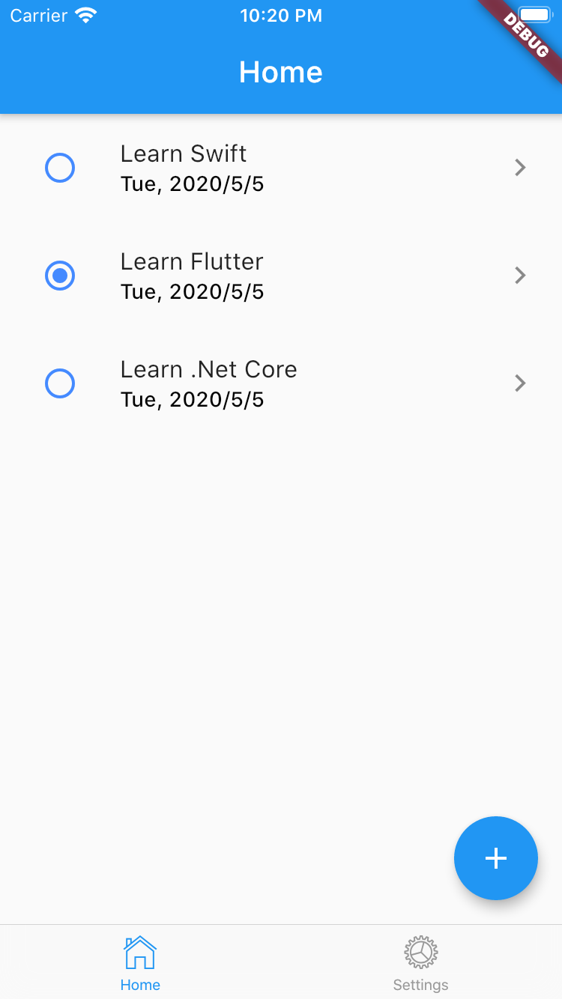

# Code flow of `to-do` app.

This is the step-by-step instructions on how to create this app from scratch.

## Table of contents.
  
1. [Prerequisites.](#Prerequisites)
1. [Creating and installing dependencies.](#Creating-and-installing-dependencies.)

## Prerequisites.

- Basic understanding of `Flutter` and `Dart`.
- Install the latest version of `Flutter` properly on your system.

## Creating and installing dependencies.

Run cmd `flutter create my_notes_flutter_mobile` to create this app.

Open `pubspec.yaml` file to include 3rd-party packages:
```yaml
...
dependencies:
  flutter:
    sdk: flutter
  provider: ^3.1.0 # The provider package for managing the state of the app.
...
```

Then run `flutter pub get` to update packages.

Open the app in `VS Code` and press `Ctrl + F5` -> Make sure you see the initial screen of flutter app with no error before moving to next step.

## Create the app's structure:

I make this app's structure similar to the `Angular` app version:
```
project
│   README.md
│   CODE_FLOW.md
│   pubspec.yaml
│
└───assets
│   
└───docs
│   │   user_manual.md
│   │
│   └───images
│       │   home_screen.png
│       │   ...
│
└───lib
│   │   app_constants.dart
│   │   app_routing.dart
│   │   main.dart
│   │   my_app.dart
│   │
│   └───components
│   │   └───login
│   │   │   │   login.dart
│   │   │   │   ...
│   │   └───home
│   │       │   home.dart
│   │       │   ...
│   │
│   └───shared
│       └───components
│       └───data
│       │   └───repositories
│       └───models
│       └───services
│   
└───test
    │   widget_test.dart
    │   widget_test2.dart
```

### Create `Home` component.

Open `main.dart` file and refactor `MyHonePage` into `Home` (in `VS Code` right-click class name and select `Rename Symbol`).

Move this `Home` component into `lib/components/home.dart` file. I prefer to set component's title inside component itself, so remove the `title` argument from its constructor:
```dart
import 'package:flutter/cupertino.dart';
import 'package:flutter/material.dart';

class Home extends StatefulWidget {
  static const String title = 'Home';

  @override
  _HomeState createState() => _HomeState();
}

class _HomeState extends State<Home> {  

  @override
  Widget build(BuildContext context) {
    return Scaffold(
      appBar: AppBar(
        title: Text(Home.title),
      ),
      body: Center(
        child: Column(
          mainAxisAlignment: MainAxisAlignment.center,
          children: <Widget>[
            Text(
              'This is Home page.',
            ),
          ],
        ),
      ),
    );
  }
}
``` 

### Create `MyApp` component.

Open `main.dart` and move `MyApp` class into `my_app.dart` file.

Edit `MyHomePage` into `Home` and import the `Home` component.

**NOTE:** To avoid potential issue, you should import with the prefix `package:<path_to_component>`. For example: `import 'package:to_do_mobile_app/components/home/home.dart';`

### Modify `main.app` file.

Open `main.app` file and mark its main() function as `async`. We need this as `async` because we need have some configurations before running the app:
```dart
void main() async {
  var myApp = MyApp();
  runApp(myApp);
}
```

Now we're able to run the app using the new structure.

### Navigate with named route.

Similar to `Angular` and `React`, in `Flutter` we can show the component based on its route name. Here I'm using `onGenerateRoute` to define routes. Modify `MyApp` component as following:
```dart
class MyApp extends StatelessWidget {
  @override
  Widget build(BuildContext context) {
    return MaterialApp(
      title: 'Flutter Demo',
      theme: ThemeData(
        primarySwatch: Colors.blue,
      ),
      initialRoute: '/',
      onGenerateRoute: (RouteSettings settings) {
        switch (settings.name) {
          case '/':
            return CupertinoPageRoute(
              builder: (_) => Home(),
            );
          default:
            assert(false, 'No route defined for ${settings.name}');
            return null;
        }
      },
      // home: Home(title: 'To Do Demo'),
    );
  }
}
```

As the app gets scaled, we would have lots of routes and business logic in each route. So it's a best practice to keep your code organized by separating the routes section into another class named `AppRouting`. This approach can also be used in `Angular` and `React`. Open `app_routing.dart` file and define the following routes:
```dart
import 'package:flutter/cupertino.dart';
import 'package:to_do_mobile_app/components/home/home.dart';

class AppRouting {
    static Route<dynamic> generateAppRoute(RouteSettings settings) {
        switch (settings.name) {
          case '/':
            return CupertinoPageRoute(
              builder: (_) => Home(),
            );
          default:
            assert(false, 'No route defined for ${settings.name}');
            return null;
        }
    }
}
```

Then use this setting inside `MyApp` component as follow:
```dart
import 'package:flutter/cupertino.dart';
import 'package:flutter/material.dart';
import 'package:to_do_mobile_app/app_routing.dart';

class MyApp extends StatelessWidget {
  @override
  Widget build(BuildContext context) {
    return MaterialApp(
      title: 'Flutter Demo',
      theme: ThemeData(
        primarySwatch: Colors.blue,
      ),
      initialRoute: '/',
      onGenerateRoute: AppRouting.generateAppRoute,
      // home: Home(title: 'To Do Demo'),
    );
  }
}
```

**Code improvements:**

As you can see we use the string `/` to name the `Home` component's route in `MyApp` class, and then inside `AppRouting` class we repeat the `/` again to show the `Home` component. So it's better to put those constant values into one place, so that when we update it, it would reflect the change to all of its references. This approach also reduces the duplicated code amd makes the app more maintainable. Let's create a class named `AppConstants` in `/lib/app_constants.dart`:
```dart
import 'package:flutter/widgets.dart';

class AppConstants {
  static const String homePath = '/';
}
```

Then update the `MyApp` and `AppRouting` as follow:
```dart
#### `/lib/my_app.dart`
...
initialRoute: AppConstants.homePath,
...

#### `/lib/app_routing.dart`
switch (settings.name) {
    case AppConstants.homePath:
      return CupertinoPageRoute(
          builder: (_) => Home(),
      );
    default:
      assert(false, 'No route defined for ${settings.name}');
      return null;
}
```

## Summary.

What we have done so far:
- Structured the app's files and folders that is similar to `Angular` and `React`.
- Navigating the app using named routes.
- Put duplicated code and constants values inside `AppConstants` class.

## Bottom Navigation Bar (Tab Bar)

In this section, we're going to implement bottom navigation bar (tab bar) using Cupertino (iOS) style. -> Why not Android, but iOS style? Well, Android uses `Hierarchical Navigation` which users have to trace back to the root of the app in order to go to another tab. Imagine you're at the 5th view of the 1st tab, and in order to get to the 2nd tab, you have to press the `Back` button 5 times to get back to the root and select the 2nd tab. That's really annoying, right. -> So I prefer to use the iOS style bottom navigation which is called `Flat Navigation`. In flat navigation, users can jump between tabs without going back to the root of the app.

Anyway, talk is cheap, show me the code. Let's create 2 components named `Settings` and `AppTabBar`. The `AppTabBar` has 2 tabs `Home` and `Settings` which will show `Home` and `Settings` component respectively when it's tapped:
```dart
#### `lib/settings/settings.dart`
import 'package:flutter/cupertino.dart';
import 'package:flutter/material.dart';

import 'package:flutter/cupertino.dart';
import 'package:flutter/material.dart';

class Settings extends StatefulWidget {
  Settings({Key key}) : super(key: key);
  
  static const String title = 'Settings';

  @override
  _SettingsState createState() => _SettingsState();
}

class _SettingsState extends State<Settings> {  

  @override
  Widget build(BuildContext context) {
    return Scaffold(
      appBar: AppBar(
        title: Text(Settings.title),
      ),
      body: Center(
        child: Column(
          mainAxisAlignment: MainAxisAlignment.center,
          children: <Widget>[
            Text(
              'This is Settings page.',
            ),
          ],
        ),
      ),
    );
  }
}

#### `lib/app_tab_bar/app_tab_bar.dart`
import 'package:flutter/cupertino.dart';
import 'package:to_do_mobile_app/components/home/home.dart';
import 'package:to_do_mobile_app/components/settings/settings.dart';

class AppTabBar extends StatefulWidget {
  @override
  _AppTabBarState createState() => _AppTabBarState();
}

class _AppTabBarState extends State<AppTabBar> {
  //#region Lifecycle.
  @override
  Widget build(BuildContext context) {
    return _buildCupertinoTabScaffold();
  }

  @override
  void dispose() {
    super.dispose();
  }
  //#end-region.

  //#region Helpers.
  CupertinoTabScaffold _buildCupertinoTabScaffold() {
    return CupertinoTabScaffold(
      tabBar: CupertinoTabBar(
        items: <BottomNavigationBarItem>[
          _buildTabBarItem(CupertinoIcons.home, Home.title),
          _buildTabBarItem(CupertinoIcons.settings, Settings.title),
        ],
      ),
      tabBuilder: (context, index) {
        return CupertinoTabView(
          builder: (context) {
            switch (index) {
              case 0:
                return Home();
              case 1:
                return Settings();
              default:
                assert(false, 'Unexpected tab');
                return null;
            }
          },
        );
      },
    );
  }

  BottomNavigationBarItem _buildTabBarItem(IconData iconData, String title) {
    return BottomNavigationBarItem(
      icon: Icon(iconData),
      title: Text(title),
    );
  }
  //#end-region.
}
```

**Explanation:**
- `tabBar`: `CupertinoTabBar` requires at least two items, or you will see errors at run-time. Those tab items are shown at the bottom of the app.
- `tabBuilder`: is responsible for making sure the specified tab is built. In this case, it calls a class constructor to set up each respective tab, wrapping all two in `CupertinoTabView` and `CupertinoPageScaffold`.

Now, let's edit the following classes:
- In `AppConstant`, rename the `homePath` as `appTabBarPath`:
- In `AppRouting`, replace the `Home` component with the `AppTabBar` component.
```dart
#### `lib/app_constants.dart`
class AppConstants {
  ...
  static const String appTabBarPath = '/';
}

#### `lib/app_routing.dart`
class AppRouting {
    static Route<dynamic> generateAppRoute(RouteSettings settings) {
        switch (settings.name) {
          case AppConstants.appTabBarPath:
            return CupertinoPageRoute(
              builder: (_) => AppTabBar(),
            );
          default:
            assert(false, 'No route defined for ${settings.name}');
            return null;
        }
    }
}
```

Run the app and you should see sth like this:


Try to tap the `Settings` tab to see the `Settings` page.

**Code improvement:**
Let's improve the code a little bit. Instead of using `index` number of tab item, we can make it human-readable by using `enum`. Add this line at the beginning of your class:
```dart
#### `lib/app_tab_bar/app_tab_bar.dart`

enum _TabItemLabelEnum { home, settings }
```

Then edit `_buildCupertinoTabScaffold` method as follow:
```dart
CupertinoTabScaffold _buildCupertinoTabScaffold() {
  return CupertinoTabScaffold(
    tabBar: CupertinoTabBar(
      items: <BottomNavigationBarItem>[
        _buildTabBarItem(CupertinoIcons.home, Home.title),
        _buildTabBarItem(CupertinoIcons.settings, Settings.title),
      ],
    ),
    tabBuilder: (context, index) {
      final tabItemLabel = _TabItemLabelEnum.values[index];
      return CupertinoTabView(
        builder: (context) {
          switch (tabItemLabel) {
            case _TabItemLabelEnum.home:
              return Home();
            case _TabItemLabelEnum.settings:
              return Settings();
            default:
              assert(false, 'Unexpected tab');
              return null;
          }
        },
      );
    },
  );
}
```

## Summary.

What we have done so far:
- Created another component named `Settings` with basic UI.
- Implemented `Bottom Navigation Bar` (tab bar) with iOS style and put it into a component named `AppTabBar`.
- Using `enum` instead of `index` to make the code more human-readable.


-------------------------------------------------- Draft.

## Create pre-populated database.

Use .Net Core to define and generate db script for Sqlite.

Download `DB Browser for Sqlite`. -> Use this app to create new db named `to_do_mobile.db` by executing the script. -> Then put this db in `assets/database/to_do_mobile.db`.

Specify the asset(s) in your `pubspec.yaml` in the flutter section:
```yaml
flutter:
  assets:
    - assets/database/to_do_mobile.db
```

In order to use `Sqlite` in this app, we need to add the following packages in `pubspec.yaml` file:
```yaml
dependencies:
  flutter:
    sdk: flutter

  sqflite: 1.3.0+1
  path_provider: 1.6.7
  path: 1.6.4
  intl: 0.16.1
```

Add the database's name in `AppConstants` class:
```dart
#### /lib/app_constants.dart
static const String databaseName = 'to_do_mobile.db';
static const String tableTodoName = 'ToDos';
```

Create the service named `AppDbContextService` in the `lib/shared/services` folder:
```dart
#### `lib/shared/services/app_db_context_service.dart`

import 'dart:io';
import 'dart:typed_data';
import 'package:flutter/foundation.dart';
import 'package:flutter/services.dart';

import 'package:path/path.dart';
import 'package:sqflite/sqflite.dart';

import 'package:to_do_mobile_app/app_constants.dart';

class AppDbContextService {
  String _databasesPath;
  Database _db;

  AppDbContextService() {}

  //#region Helpers.
  //#end-region.

  Future<void> initDb() async {
    _databasesPath = await getDatabasesPath();
    _databasesPath = join(_databasesPath, AppConstants.databaseName);

    // Check if the database exists.
    bool exists = await databaseExists(_databasesPath);

    if (!exists) {
      // Should happen only the first time when you launch your app.
      debugPrint("Database not exist. Creating new copy from assets.");

      // Make sure the parent directory exists.
      try {
        await Directory(dirname(_databasesPath)).create(recursive: true);

        // Copy from asset.
        ByteData data = await rootBundle.load(join("assets/database", AppConstants.databaseName));
        List<int> bytes = data.buffer.asUint8List(data.offsetInBytes, data.lengthInBytes);
        
        // Write and flush the bytes written.
        await File(_databasesPath).writeAsBytes(bytes, flush: true);
      } catch (e) {
        debugPrint('Exception in AppDbContextService.initDb(). e is: $e');
      }
    } else {
      debugPrint("Database already exists.");
    }
    // open the database.
    _db = await openDatabase(_databasesPath);
    debugPrint('initDb successfully. _databasesPath is: $_databasesPath');
  }
}
```

Next step is to implement the Dependency Injection (DI) design pattern to inject the `AppDbContext` service.

## Dependency Injection.

In order to use DI in this app, we need to add the package `get_it` into `pubspec.yaml`:
```yaml
get_it: 4.0.2
```

Create `AppInjections` class to register the services we want to inject in this app:
```dart
#### `/lib/app_injections.dart`

import 'package:get_it/get_it.dart';

import 'package:to_do_mobile_app/shared/services/app_db_context_service.dart';

final GetIt getIt = GetIt.instance;

class AppInjections {
  static Future<void> setupDI() async {
    final appDbContextService = AppDbContextService();
    // Register services.
    getIt.registerSingletonAsync<AppDbContextService>(() async {
      return appDbContextService;
    });

    // Wait for db initialization.
    await appDbContextService.initDb();
  }
}
```

Then call the method `setupDI` in `main.dart` to setup DI:
```dart
#### `lib/main.dart`

void main() async {
  WidgetsFlutterBinding.ensureInitialized(); // Ensure that the Flutter app initializes properly before initializing other configurations.
  
  var myApp = MyApp();
  await AppInjections.setupDI();
  
  runApp(myApp);
}
```

Now when you run your app (on iOS), you should see the log console like so:
```bash
flutter: Database not exist. Creating new copy from assets.
flutter: initDb successfully. _databasesPath is: <path_to_database>/Documents/to_do_mobile.db
```

You can use `DB Browser` to open the db in `<path_to_database>/Documents/to_do_mobile.db` and check to see if it's the same as the pre-populated DB in the `assets/database/to_do_mobile.db`.

## Summary.

What we have done so far:
- Created the pre-populated database named `to_do_mobile.db`.
- Installed necessary packages to support `Sqlite` in this app.
- Created `AppDbContextService` to init the database.
- Implemented Dependency Injections (DI) design pattern to inject the database service into the app.

## Show list of to-do items.

In this part, we're going to use `repository` pattern to do the CRUD operations and `rxdart` package to implement `reactive programming` to handle `single source of truth`.

Add the `rxdart` package into `pubspec.yaml`:
```yaml
rxdart: 0.24.0
```

Create a `ToDo` model to capture the to-do item:
```dart
#### `lib/shared/models/to_do_model.dart`

class ToDo {
  static final String idColumn = 'Id';
  static final String createdDateColumn = 'CreatedDate';
  static final String descriptionColumn = 'Description';
  static final String guidColumn = 'Guid';
  static final String isDeletedColumn = 'IsDeleted';
  static final String isDoneColumn = 'IsDone';
  static final String updatedDateColumn = 'UpdatedDate';

  int id;
  String createdDate;
  String description;
  String guid;
  bool isDeleted;
  bool isDone;
  String updatedDate;

  ToDo(
      {this.id,
      this.createdDate,
      this.description,
      this.guid,
      this.isDeleted,
      this.isDone,
      this.updatedDate});

  ToDo.fromJson(Map<String, dynamic> json) {
    id = json[idColumn];
    createdDate = json[createdDateColumn];
    description = json[descriptionColumn];
    guid = json[guidColumn];
    isDeleted = json[isDeletedColumn] == 1;
    isDone = json[isDoneColumn] == 1;
    updatedDate = json[updatedDateColumn];
  }

  Map<String, dynamic> toJson() {
    final Map<String, dynamic> data = new Map<String, dynamic>();
    
    if (id != null) {
      data[idColumn] = id;
    }
    
    data[createdDateColumn] = createdDate;
    data[descriptionColumn] = description;
    data[guidColumn] = guid;
    data[isDeletedColumn] = isDeleted == true ? 1 : 0;
    data[isDoneColumn] = isDone == true ? 1 : 0;
    data[updatedDateColumn] = updatedDate;
    return data;
  }
}
```

Create `ToDoResourceParameters`:
```dart
#### `/lib/shared/parameters/to_do_resource_parameters.dart`

class ToDoResourceParameters {
  final String searchQuery;

  ToDoResourceParameters({this.searchQuery});

  Map<String, dynamic> toJson() {
    final Map<String, dynamic> data = new Map<String, dynamic>();
    data['searchQuery'] = this.searchQuery;
    return data;
  }
}
```

Edit `AppDbContext`, add the following codes:
```dart
/* DataStore stuffs for ToDos. */
List<ToDo> _toDos;

List<ToDo> get toDos { return _toDos; }
set toDos(List<ToDo> value) { _toDos = value ?? null; }
```

Create `ToDoRepoService` in `lib/shared/data/repositories`:
```dart
#### `/lib/shared/services/repositories/to_do_repo_service.dart`

import 'package:flutter/foundation.dart';
import 'package:rxdart/rxdart.dart' as rxdart;
import 'package:to_do_mobile_app/app_constants.dart';

import 'package:to_do_mobile_app/shared/models/to_do_model.dart';
import 'package:to_do_mobile_app/shared/parameters/to_do_resource_parameters.dart';
import 'package:to_do_mobile_app/shared/services/app_db_context_service.dart';
import 'package:to_do_mobile_app/app_injections.dart';

class ToDoRepoService {
  var _toDosBehaviorSubject = rxdart.BehaviorSubject<List<ToDo>>();

  Stream<List<ToDo>> get toDosObservable => _toDosBehaviorSubject.asBroadcastStream();

  AppDbContextService _appDbContextService;

  ToDoRepoService() {
    _appDbContextService = _appDbContextService ?? getIt<AppDbContextService>();
  }

  Future getListAsync(ToDoResourceParameters toDoResourceParameters) async {
    dynamic error;

    try {
      // Get data from local Sqlite Db. In the web app (like Angular or React), we get data by using `http`.
      var readOnlyList = await _appDbContextService.database?.query(
        AppConstants.tableTodoName, 
        columns: [ToDo.idColumn, ToDo.descriptionColumn, ToDo.guidColumn, ToDo.isDoneColumn, ToDo.isDeletedColumn], 
        where: '${ToDo.isDeletedColumn} = ?', whereArgs: [0],
      );
      List<ToDo> list = readOnlyList?.map((item) => ToDo.fromJson(item))?.toList();
      _appDbContextService.toDos = List<ToDo>.from(list); // Create a new map to modify it in memory.
      // Notify to all listeners.
      _toDosBehaviorSubject.add(_appDbContextService.toDos);
      return Future.value();
    } catch (e) {
      error = e;
      debugPrint('ToDoRepoService getListAsync failed. error is: $error');
    }
    return Future.error(error);
  }
}
```

Register `ToDoRepoService` in `AppInjections` class:
```dart
#### `/lib/app_injections.dart`

class AppInjections {
  static Future<void> setupDI() async {
    // Register services.
    ...

    getIt.registerSingletonAsync<ToDoRepoService>(() async => ToDoRepoService());
  }
}
```

Edit `Home` component to get the to-do list:
```dart
#### `/lib/components/home/home.dart`

import 'dart:async';
import 'dart:convert';
import 'package:flutter/cupertino.dart';
import 'package:flutter/material.dart';
import 'package:to_do_mobile_app/app_injections.dart';
import 'package:to_do_mobile_app/shared/data/repositories/to_do_repo_service.dart';

import 'package:to_do_mobile_app/shared/models/to_do_model.dart';

class Home extends StatefulWidget {
  static const String title = 'Home';

  @override
  _HomeState createState() => _HomeState();
}

class _HomeState extends State<Home> {
  StreamSubscription<List<ToDo>> _toDosObservableSubscriber;
  List<ToDo> _toDos;

  /* DI Services vars. */
  ToDoRepoService _toDoRepoService;

  _HomeState() {
    /* DI Services. */
    _toDoRepoService = _toDoRepoService ?? getIt<ToDoRepoService>();

    _toDos = [];
  }

  //#region Lifecycle.
  @override
  void initState() {
    super.initState();
    _toDosObservableSubscriber = _toDoRepoService.toDosObservable.listen((data) {
      debugPrint(json.encode(data));
      _toDos = data;
      if (_toDos != null) {
        setState(() {});
      }
    });

    this._getListAsync();
  }

  @override
  Widget build(BuildContext context) {
    ...
  }

  @override
  void dispose() {
    super.dispose();
    _toDosObservableSubscriber.cancel();
  }
  //#end-region.

  Future _getListAsync() async {
    try {
      await _toDoRepoService.getListAsync(null);
    } catch (e) {
      debugPrint('_getListAsync failed.');
    } finally {
    }
  }
}
```

Now when you run the app, you should see the result of 3 rows printed in the log console like so:
```bash
flutter: Database already exists.
flutter: initDb successfully. _databasesPath is: <...>/Documents/to_do_mobile.db
flutter: [{"Id":1,"CreatedDate":null,"Description":"Learn Swift","Guid":"0a3b06dca81fcb47391996ed1f41e69a","IsDeleted":0,"IsDone":0,"UpdatedDate":null},{"Id":2,"CreatedDate":null,"Description":"Learn Flutter","Guid":"edd579c6d28b20951e62fc0316b41520","IsDeleted":0,"IsDone":0,"UpdatedDate":null},{"Id":3,"CreatedDate":null,"Description":"Learn .Net Core","Guid":"1616de86895b0075a9b00cc5f6fef06c","IsDeleted":0,"IsDone":0,"UpdatedDate":null}]
```

## Summary.

What we have done so far:
- Added `rxdart` package to implement reactive programming using Observables.
- Created `ToDoRepoService` and inject it into the app.
- Logging the result in the log console by listening to the result changes.
- Created the `ToDo` model to map the result from Sqlite db.

Next step is to show these 3 rows on the UI.

## Show list on `Home` page.

Edit the `build` method of `Home` component:
```dart
#### `/lib/components/home/home.dart`

import 'package:intl/intl.dart';

...
class Home extends StatefulWidget {
  ...
}

class _HomeState extends State<Home> {
  ...

  @override
  Widget build(BuildContext context) {
    return Scaffold(
      appBar: AppBar(
        title: Text(Home.title),
      ),
      body: Center(
        child: ListView(
          children: _toDos?.map((item) {
            return Dismissible(
              key: Key(item?.id.toString()),
              child: ListTile(
                leading: IconButton(
                  icon: Icon((item?.isDone == true ? Icons.radio_button_checked : Icons.radio_button_unchecked), color: Colors.blueAccent,),
                  onPressed: () {},
                ),
                title: Text(                  
                  item?.description ?? '',
                  maxLines: 2,
                  overflow: TextOverflow.ellipsis,
                  style: Theme.of(context).textTheme.subtitle1,
                ),
                subtitle: Text(
                  (item.updatedDate ?? '') == '' ? '' : '${DateFormat('EEE, y/M/d').format(DateTime.parse(item.updatedDate))}',
                  overflow: TextOverflow.ellipsis,
                  style: Theme.of(context).textTheme.subtitle2,
                ),
                onTap: () {},
              ),
            );
          })?.toList(),
        )
      ),
    );
  }

  ...
}
```

Then run the app and you should see the following UI:


**Code improvement: Use ListView.builder for a long list**

When working with infinite lists or very long lists, it’s usually advisable to use a `ListView.builder` in order to improve performance. -> Why? -> Because the `ListView` constructor builds the whole list at once. But the `ListView.builder` creates a lazy list that when the users scroll down the list, Flutter builds widgets on-demand. Let's modify the `build` method like so:
```dart
#### `/lib/components/home/home.dart`

...
class Home extends StatefulWidget {
  ...
}

class _HomeState extends State<Home> {
  ...

  _HomeState() {
    /* DI Services. */
    _toDoRepoService = _toDoRepoService ?? getIt<ToDoRepoService>();

    // _toDos = []; // Remove this line when using `ListView.builder`.
  }

  @override
  Widget build(BuildContext context) {
    return Scaffold(
      appBar: AppBar(
        title: Text(Home.title),
      ),
      body: Center(
        child: ListView.builder(
          itemCount: _toDos == null ? 0 : _toDos.length,
          itemBuilder: (BuildContext context, int index) {
            ToDo item = _toDos[index];
            return Dismissible(
              ...
            );
          },
        ),
      ),
    );
  }

  ...
}
```

## Create a new to-do item.

Edit the `build` method of `Home` component to add the `Add` button at the bottom:
```dart
#### `/lib/components/home/home.dart`

class Home extends StatefulWidget {
  ...
}

class _HomeState extends State<Home> {
  ...

  @override
  Widget build(BuildContext context) {
    return Scaffold(
      appBar: AppBar(
        ...
      ),
      body: Center(
        child: ListView.builder(
          ...
        ),
      ),
      floatingActionButton: Padding(
        padding: const EdgeInsets.only(bottom: 50.0), // Use padding because the bottom bar covers it.
        child: FloatingActionButton(
          child: Icon(Icons.add),
          onPressed: () {},
        ),
      ),
    );
  }
}
```

Then run the app and you should see the following UI:



Next, let's create a new component named `AddToDo` with basic UI in `lib/components/add_to_do/add_to_do.dart` so that when users click the `Add` button, it'll get to this page. Also, we need to add a new constant value path for this component in `AppConstants`:
```dart
#### `lib/components/add_to_do/add_to_do.dart`

import 'package:flutter/material.dart';

import 'package:flutter/material.dart';

class AddToDo extends StatefulWidget {
  static const String title = 'AddToDo';

  @override
  _AddToDoState createState() => _AddToDoState();
}

class _AddToDoState extends State<AddToDo> {
  final _formKey = GlobalKey<FormState>();

  @override
  Widget build(BuildContext context) {
    return Scaffold(
      appBar: AppBar(
        title: Text(AddToDo.title),
        actions: <Widget>[
          FloatingActionButton(
            child: Text('Done'),
            backgroundColor: Colors.transparent,
            foregroundColor: Colors.yellowAccent,
            elevation: 0, // This is to hide the shadow.
            onPressed: () {
              FocusScope.of(context).unfocus();
            },
          ),
        ],
      ),
      body: GestureDetector( // Catch event when tapping outside.
        onTap: () {
          FocusScope.of(context).unfocus(); // Hide/ dismiss keyboard.
        },
        child: SafeArea(
          minimum: const EdgeInsets.all(8),
          child: Scrollbar(
            child: ListView(
              children: <Widget>[
                Form(
                  key: _formKey,
                  child: TextFormField(
                    decoration: InputDecoration(
                      border: OutlineInputBorder(),
                      labelText: "Add to-do",
                      hintText: "Add new to-do.",
                    ),
                    keyboardType: TextInputType.multiline,
                    maxLines: null, // To use auto wrap.
                    // autofocus: true,
                  ),
                ),
              ],
            ),
          ),
        ),
      ),
    );
  }
}

#### `lib/app_constants.dart`

class AppConstants {
  ...
  static const String addToDoPath = '/add-to-do';
  ...
}
```

Create `ToDoParameters` class in `lib/shared/parameters/to_do_parameters.dart`:
```dart
#### `lib/shared/parameters/to_do_parameters.dart`

import 'package:to_do_mobile_app/shared/models/to_do_model.dart';

class ToDoParameters {
  final int id;

  ToDoParameters({this.id});

  Map<String, dynamic> toJson() {
    final Map<String, dynamic> data = new Map<String, dynamic>();
    data[ToDo.idColumn] = this.id;
    return data;
  }
}
```

Add new method named `generateAppTabBarRoute` inside `AppRouting` class:
```dart
#### `lib/app_routing.dart`

class AppRouting {
  /// Routing outside the `AppTabBar`.
  static Route<dynamic> generateAppRoute(RouteSettings settings) {
    ...
  }

  /// Routing inside the `AppTabBar`.
  static Route<dynamic> generateAppTabBarRoute(RouteSettings settings) {
    switch (settings.name) {
      case AppConstants.addToDoPath:
        return CupertinoPageRoute(
          builder: (_) => AddToDo(),
        );
      default:
        assert(false, 'No route defined for ${settings.name}');
        return null;
    }
  }
}
```

Then in `AppTabBar`, edit method `_buildCupertinoTabScaffold` to generate routes inside the `AppTabBar` for all tabs:
```dart
#### `lib/components/app_tab_bar/app_tab_bar.dart`

class AppTabBar extends StatefulWidget {
  ...
}

class _AppTabBarState extends State<AppTabBar> {
  ...

  //#region Helpers.
  CupertinoTabScaffold _buildCupertinoTabScaffold() {
    return CupertinoTabScaffold(
      tabBar: CupertinoTabBar(
        ...
      ),
      tabBuilder: (context, index) {
        final tabItemLabel = _TabItemLabelEnum.values[index];
        return CupertinoTabView(
          builder: (context) {
            ...
          },
          // Generate routes inside `AppTabBar` for all tabs.
          onGenerateRoute: AppRouting.generateAppTabBarRoute,
        );
      },
    );
  }

  ...
  //#end-region.
}
```

In `Home` component, add method `_navigateTo` which is called in `onPressed` event when the `Add` button clicked:
```dart
#### `lib/components/home/home.dart`

class Home extends StatefulWidget {
  ...
}

class _HomeState extends State<Home> {
  ...

  @override
  Widget build(BuildContext context) {
    return Scaffold(
      appBar: AppBar(
        ...
      ),
      body: Center(
        ...
      ),
      floatingActionButton: Padding(
        ...
        child: FloatingActionButton(
          child: Icon(Icons.add),
          onPressed: () {
            _navigateTo(null, AppConstants.addToDoPath);
          },
        ),
      ),
    );
  }

  ...

  void _navigateTo(ToDo toDo, String componentPath) {
    var queryParamsObj = ToDoParameters(id: toDo?.id);
    Navigator.pushNamed(context, componentPath, arguments: queryParamsObj);
  }
  //#end-region.
}
```

Run the app and click the `Add` button to get to the `AddToDo` component. After clicking `Add` button, you should see sth like so:


Next step is we need to save the new to-do item when tapping `Done` or `Back` button.

## Add new item to database.

In `pubspec.yaml`, add the package `uuid` to generate guid:
```yaml
#### `pubspec.yaml`

...
dependencies:
  flutter:
    sdk: flutter

  ...
  uuid: 2.0.4 # Generate Guid.
...
```

In `ToDoRepoService`, add methods `addAsyncGet` and `addAsyncPost`:
```dart
#### `lib/shared/repositories/to_do_repo_service.dart`

class ToDoRepoService {
  ...

  Future<ToDo> addAsyncGet() async {
    dynamic error;

    try {
      // Get the empty to-do model. In the web app, we get it from the server API.
      return Future.value(new ToDo(createdDate: DateTime.now().toUtc().toString(), guid: Uuid().v1(), updatedDate: DateTime.now().toUtc().toString()));
    } catch (e) {
      error = e;
      debugPrint('ToDoRepoService addAsyncGet failed. error is: $error');
    }
    return Future.error(error);
  }

  Future<ToDo> addAsyncPost(ToDo paramObj) async {
    dynamic error;
    var db = _appDbContextService.database;

    try {
      List<dynamic> results;
      await db?.transaction((txn) async {
        var batch = txn.batch();
        batch.insert(
          AppConstants.tableTodoName,
          paramObj.toJson(),
        );
        results = await batch.commit();
        // debugPrint('results is: ${json.encode(results)}');
      });
      if (results != null) {
        paramObj.id = results[0];
        var list = List<ToDo>.from(_appDbContextService.toDos);
        list.insert(0, paramObj);
        _appDbContextService.toDos = list;
        _toDosBehaviorSubject.add(_appDbContextService.toDos);
        return Future.value(paramObj);
      }
    } catch (e) {
      error = e;
      print('ToDoRepoService addAsyncPost failed. error is: $error');
    }
    return Future.error(error);
  }
}
```

In `AddToDo`, inject `ToDoRepoService` and add methods `_addAsyncGet`, `_addAsyncPost` and `_validateAndSaveForm`, then call `_addAsyncPost` on adding new item. We also need to validate the description's value and capture it into the `ToDo` model in the `build` method:
```dart
#### `lib/components/add_to_do/add_to_do.dart`

class AddToDo extends StatefulWidget {
  ...
}

class _AddToDoState extends State<AddToDo> {
  final _formKey = GlobalKey<FormState>();
  ToDo _newToDo;

  /* DI Services vars. */
  ToDoRepoService _toDoRepoService;

  _AddToDoState() {
    /* DI Services. */
    _toDoRepoService = _toDoRepoService ?? getIt<ToDoRepoService>();
  }

  //#region Lifecycle.
  @override
  void initState() {
    super.initState();    

    _addAsyncGet();
  }

  @override
  Widget build(BuildContext context) {
    return Scaffold(
      appBar: AppBar(
        ...
      ),
      body: GestureDetector(
        onTap: () {
          ...
        },
        child: SafeArea(
          minimum: const EdgeInsets.all(8),
          child: Scrollbar(
            child: ListView(
              children: <Widget>[
                Form(
                  key: _formKey,
                  child: TextFormField(
                    ...
                    validator: (value) => value.isNotEmpty ? null : 'Description can\'t be empty',
                    onSaved: (value) => _newToDo.description = value?.trim(),
                  ),
                ),
              ],
            ),
          ),
        ),
      ),
    );
  }

  //#region Helpers.
  Future _addAsyncGet() async {
    bool isOk = false; ToDo response;
    
    try {
      ToDo res = await _toDoRepoService.addAsyncGet();
      if (res != null) {
        response = res;
        isOk = true;
      }
    } catch (e) {
      debugPrint('_addAsyncGet failed.');
    } finally {
      if (isOk) {
        setState(() {
          _newToDo = response;
        });
      }
    }
  }

  Future _addAsyncPost() async {
    if (!_validateAndSaveForm()) { return; }

    bool isOk = false;
    try {
      ToDo copiedNewToDo = ToDo.fromJson(_newToDo.toJson());

      ToDo res = await _toDoRepoService.addAsyncPost(copiedNewToDo);
      isOk = true;
    } catch (e) {
      debugPrint('_addAsyncPost failed');
    } finally {
      if (isOk) {}
    }
  }

  bool _validateAndSaveForm() {
    final form = _formKey.currentState;
    if (form.validate()) {
      form.save();
      return true;
    }
    return false;
  }
  //#end-region.
}
```

Run the app and try to add new item -> Then press `Done` button, it'll get back to the `Home` page and you should see the new item is added.

**Code improvements**
In `ToDoRepoService` class, let's modify method `getListAsync` to show the items based on the column `UpdatedDate` in descending order:
```dart
#### `lib/shared/repositories/to_do_repo_service.dart`

class ToDoRepoService {
  ...
  Future getListAsync(ToDoResourceParameters toDoResourceParameters) async {
    ...
    var readOnlyList = await _appDbContextService.database?.query(
      AppConstants.tableTodoName, 
      columns: [ToDo.idColumn, ToDo.descriptionColumn, ToDo.guidColumn, ToDo.isDoneColumn, ToDo.updatedDateColumn, ToDo.isDeletedColumn], 
      where: '${ToDo.isDeletedColumn} = ?', whereArgs: [0],
      orderBy: '${ToDo.updatedDateColumn} DESC'
    );
    ...
  }
}
```

## Summary.

What we have done so far:
- Showed the list on the `Home` component ordered by `UpdatedDate` column in the descending order.
- Added new component `AddToDo` to implement the Create operation.

Next step is to implement Read, Update and Delete operations.

--------------------------------------------------

# References:

- [Flutter: Best Practices and Tips](https://medium.com/flutter-community/flutter-best-practices-and-tips-7c2782c9ebb5)