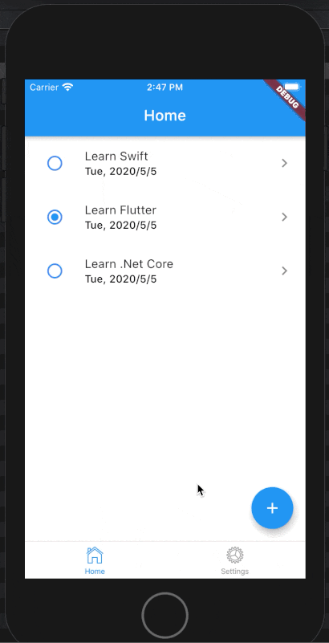

# Building Cross Platform Mobile Apps with Flutter

Welcome to my series on how to write cross-platform mobile app using [`Flutter`](https://flutter.dev/docs). What is `Flutter`?, it's a framework used to create cross-platform mobile applications (iOS, Android and Website). It's similar to `React Native` or `Ionic` frameworks if you've heard of them before.

So why use `Flutter` instead of `React Native` or `Ionic`? Well, I used those 2 frameworks before and I didn't have a great experience. I come from a `.Net` and `Angular` background, and I see I can reuse my knowledge and skills of `.Net` and `Angular` into `Flutter`. For example, one of my hobby apps uses `.Net Core` for its back-end API, `Angular` for the website and `Flutter` for the mobile app. And I can reuse about 80% of the concepts from `.Net` and `Angular` into `Flutter`. So I would like to share it in this article.

What you'll learn in this series:

- How to build a `To-do` app that runs on `iOS` and `Android`.
- Reuse some concepts from `.Net` and `Angular` into `Flutter` app.
- Apply some recommended practices and tips when creating `Flutter` apps.




The source code and instruction article can be found on [Github](https://github.com/tuanbs/to-do-mobile-app.git) in the [CODE_FLOW.md](https://github.com/tuanbs/to-do-mobile-app/blob/master/CODE_FLOW.md) file.

Links to sections of this series:

- Section 1 - [Create the initial `Flutter` app]()
- Section 2 - [`Dependency Injection (DI)`, `Observable` & `Repository` patterns]()
- Section 3 - [Implementing `CRUD` operations]()

## Pre-requisites

This tutorial is for everyone who has experience with at least one of the programming languages such as `C#, Java, Javascript etc...`. However it would be easier for you to follow along with the code if you have the followings:

- Basic understanding of `Flutter` and [`Dart`](https://dart.dev/).
- Familiar with some front-end frameworks like `Angular` or `React`.

To code along with this post, please prepare the followings:

- Install the latest version of `Flutter` properly on your system. Check [here](https://flutter.dev/docs) for more information.
- Install Visual Studio Code (VSCode). You can use your preferred editor such as `Atom` or `Android Studio`.

> **NOTE:** At the time of writing this article, I use `Flutter` version `1.17.0` on macOS Catalina.

Enough talking, let's create the app.

## Create the initial `Flutter` app

To create the initial app, run cmd:
```bash
flutter create my_notes_flutter_mobile
```

Open the app in `VSCode` and press `Ctrl + F5`, then make sure you see the initial screen of your flutter app without any error before moving to next step.

## Folder structure

Here I have used similar conventions to `Angular` app folder structure I have used in the past:

```
my_notes_flutter_mobile
  assets/
    database/
      to_do_mobile.db
    images/
      ...
  docs/
    database_design/
      ...
    images/
      ...
  lib/
    components/
      app_tab_bar/
        app_tab_bar.dart
      add_to_do/
        add_to_do.dart      
      edit_to_do/
        edit_to_do.dart
      home/
        home.dart
      settings/
        settings.dart
    shared/
      components/
        ...
      data/
        repositories/
          setting_repo_service.dart
          to_do_repo_service.dart
      models/
        to_do_model.dart
      parameters/
        to_do_parameters.dart
        to_do_resource_parameters.dart
        ...
      services/
        app_db_context_service.dart
    app_constants.dart
    app_globals.dart
    app_injections.dart
    app_routing.dart
    main.dart
    my_app.dart
  test/
    ...
  README.md
  CODE_FLOW.md
  pubspec.yaml
  ...
```

### Explanations

In `Angular` or `React` apps, we use the concept of `component` to implement the separation of concerns in software development. We can use this `components` approach in our `Flutter` apps as well.

> **NOTE:** I, however, encourage people to use whatever the folder structure they prefer as long as it makes sense to them. And try to use the similar structure into different frameworks regardless of what programming language those frameworks are using. This approach enables you as a software developer to maintain the apps easier without the need to learn different concepts from different frameworks (or programming languages).

## Reorganize the initial app and navigate with named routes

In this step, we're going to reorganize the initial app using our folder structure mentioned above.

### Create `Home` component

Open `main.dart` file and refactor `MyHomePage` into `Home`.

> **Tips:** To refactor class's name (or variables and methods) in `VSCode`, right-click on the class's name and select `Rename Symbol`. Then input the new name for it.

Move this `Home` component into `lib/components/home.dart` file. By default, `Flutter` generates a new stateful component with the `title` argument inside its constructor. However, as we're not going to set component's title via its constructor, I prefer the title sticks inside its own component. So let's remove the `title` argument from its constructor like so:

`lib/components/home.dart`

```dart
import 'package:flutter/cupertino.dart';
import 'package:flutter/material.dart';

class Home extends StatefulWidget {
  static const String title = 'Home';

  @override
  _HomeState createState() => _HomeState();
}

class _HomeState extends State<Home> {  

  @override
  Widget build(BuildContext context) {
    return Scaffold(
      appBar: AppBar(
        title: Text(Home.title),
      ),
      body: Center(
        child: Column(
          mainAxisAlignment: MainAxisAlignment.center,
          children: <Widget>[
            Text(
              'This is Home page.',
            ),
          ],
        ),
      ),
    );
  }
}
```

### Create `MyApp` component

Open `main.dart` and move `MyApp` class into `my_app.dart` file. Then import the `Home` component.

> **NOTE:** To avoid potential issue, you should import with the prefix `package:<path_to_component>`. For example: `import 'package:to_do_mobile_app/components/home/home.dart';`

### Modify `main.app` file

Open `main.app` file and mark its `main()` function as `async` because we will need to have some configurations set up later on before running the app:

`lib/main.app`
```dart
void main() async {
  var myApp = MyApp();
  runApp(myApp);
}
```

Now we're able to run the app using our own new folder structure. Make sure there's no error before moving to next step.

### Navigate between components using named route

Similar to `Angular` and `React`, in `Flutter` we can show the component based on its route name. Here I'm using `onGenerateRoute` to define app's routes. Let's modify the `MyApp` component as following:

`lib/my_app.dart`
```dart
class MyApp extends StatelessWidget {
  @override
  Widget build(BuildContext context) {
    return MaterialApp(
      title: 'Flutter Demo',
      theme: ThemeData(
        primarySwatch: Colors.blue,
      ),
      initialRoute: '/',
      onGenerateRoute: (RouteSettings settings) {
        switch (settings.name) {
          case '/':
            return CupertinoPageRoute(
              builder: (_) => Home(),
            );
          default:
            assert(false, 'No route defined for ${settings.name}');
            return null;
        }
      },
      // home: Home(title: 'To Do Demo'),
    );
  }
}
```

As the app gets scaled, we would have lots of routes and business logic in each route. So it's a best practice to separate the routes section into another class named `AppRouting`. This approach can also be used in `Angular` and `React`. Let's open `app_routing.dart` file and define the following routes:

`lib/app_routing.dart`
```dart
import 'package:flutter/cupertino.dart';
import 'package:to_do_mobile_app/components/home/home.dart';

class AppRouting {
    static Route<dynamic> generateAppRoute(RouteSettings settings) {
        switch (settings.name) {
          case '/':
            return CupertinoPageRoute(
              builder: (_) => Home(),
            );
          default:
            assert(false, 'No route defined for ${settings.name}');
            return null;
        }
    }
}
```

Then use this setting inside `MyApp` component as follow:

`lib/my_app.dart`
```dart
import 'package:flutter/cupertino.dart';
import 'package:flutter/material.dart';
import 'package:to_do_mobile_app/app_routing.dart';

class MyApp extends StatelessWidget {
  @override
  Widget build(BuildContext context) {
    return MaterialApp(
      title: 'Flutter Demo',
      theme: ThemeData(
        primarySwatch: Colors.blue,
      ),
      initialRoute: '/',
      onGenerateRoute: AppRouting.generateAppRoute,
    );
  }
}
```

### Code improvements

As you can see we use the string `/` to name the `Home` component's route in `MyApp` class. And then inside `AppRouting` class, we repeat the `/` again to show the `Home` component. It's better to put those constant values into one place, so that when we update it, it would reflect the change to all of its references. This approach also reduces the duplicated code amd makes the app more maintainable. Let's create a class named `AppConstants`:

`/lib/app_constants.dart`
```dart
import 'package:flutter/widgets.dart';

class AppConstants {
  static const String homePath = '/';
}
```

Then update the `MyApp` and `AppRouting` as follow:

`/lib/my_app.dart`
```dart
// ...
initialRoute: AppConstants.homePath,
// ...
```

`/lib/app_routing.dart`
```dart
switch (settings.name) {
    case AppConstants.homePath:
      return CupertinoPageRoute(
          builder: (_) => Home(),
      );
    default:
      assert(false, 'No route defined for ${settings.name}');
      return null;
}
```

## Bottom Navigation Bar (Tab Bar)

Next, we're going to implement our bottom navigation bar (tab bar) using the `Cupertino (iOS) style`.

You would ask the question why not `Android`, but `iOS style`? Well, `Android` uses `Hierarchical Navigation` which users have to trace back to the root of the app in order to go to another tab. Imagine you're at the 5th view of the 1st tab, and in order to get to the 2nd tab, you have to press the `Back` button 5 times to get back to the root and select the 2nd tab. So I think that's really annoying. That's why I prefer to use the `iOS style` bottom navigation which is called `Flat Navigation`. In flat navigation, users can jump between tabs without going back to the root of the app.

Let's create 2 components named `Settings` and `AppTabBar`. The `AppTabBar` has 2 tabs `Home` and `Settings` which will show the `Home` and `Settings` component respectively when it's tapped:

`lib/settings/settings.dart`
```dart
import 'package:flutter/cupertino.dart';
import 'package:flutter/material.dart';

class Settings extends StatefulWidget {
  Settings({Key key}) : super(key: key);
  
  static const String title = 'Settings';

  @override
  _SettingsState createState() => _SettingsState();
}

class _SettingsState extends State<Settings> {  

  @override
  Widget build(BuildContext context) {
    return Scaffold(
      appBar: AppBar(
        title: Text(Settings.title),
      ),
      body: Center(
        child: Column(
          mainAxisAlignment: MainAxisAlignment.center,
          children: <Widget>[
            Text(
              'This is Settings page.',
            ),
          ],
        ),
      ),
    );
  }
}
```

`lib/app_tab_bar/app_tab_bar.dart`
```dart
import 'package:flutter/cupertino.dart';
import 'package:to_do_mobile_app/components/home/home.dart';
import 'package:to_do_mobile_app/components/settings/settings.dart';

class AppTabBar extends StatefulWidget {
  @override
  _AppTabBarState createState() => _AppTabBarState();
}

class _AppTabBarState extends State<AppTabBar> {
  //#region Lifecycle.
  @override
  Widget build(BuildContext context) {
    return _buildCupertinoTabScaffold();
  }

  @override
  void dispose() {
    super.dispose();
  }
  //#end-region.

  //#region Helpers.
  CupertinoTabScaffold _buildCupertinoTabScaffold() {
    return CupertinoTabScaffold(
      tabBar: CupertinoTabBar(
        items: <BottomNavigationBarItem>[
          _buildTabBarItem(CupertinoIcons.home, Home.title),
          _buildTabBarItem(CupertinoIcons.settings, Settings.title),
        ],
      ),
      tabBuilder: (context, index) {
        return CupertinoTabView(
          builder: (context) {
            switch (index) {
              case 0:
                return Home();
              case 1:
                return Settings();
              default:
                assert(false, 'Unexpected tab');
                return null;
            }
          },
        );
      },
    );
  }

  BottomNavigationBarItem _buildTabBarItem(IconData iconData, String title) {
    return BottomNavigationBarItem(
      icon: Icon(iconData),
      title: Text(title),
    );
  }
  //#end-region.
}
```

### Explanations

- `tabBar`: `CupertinoTabBar` requires at least two items, or you will see errors at run-time. Those tab items are shown at the bottom of the app.
- `tabBuilder`: is responsible for making sure the specified tab is built. In this case, it calls a class constructor to set up each respective tab, wrapping all two in `CupertinoTabView` and `CupertinoPageScaffold`.

Now, let's edit the following classes:

- In `AppConstant`, refactor the `homePath` into `appTabBarPath`:
- In `AppRouting`, replace the `Home` component with the `AppTabBar` component.

`lib/app_constants.dart`

```dart
class AppConstants {
  // ...
  static const String appTabBarPath = '/';
}
```

`lib/app_routing.dart`
```dart
class AppRouting {
    static Route<dynamic> generateAppRoute(RouteSettings settings) {
        switch (settings.name) {
          case AppConstants.appTabBarPath:
            return CupertinoPageRoute(
              builder: (_) => AppTabBar(),
            );
          default:
            assert(false, 'No route defined for ${settings.name}');
            return null;
        }
    }
}
```

Run the app and you should see the following screen:


Try to tap the `Settings` tab to see the `Settings` page.

### Code improvements

Let's improve the code a little bit. Instead of using `index` number of tab item, we can make it human-readable by using `enum`. Add this line at the beginning of your class:

`lib/app_tab_bar/app_tab_bar.dart`
```dart
enum _TabItemLabelEnum { home, settings }
```

Then edit `_buildCupertinoTabScaffold` method as follow:

```dart
CupertinoTabScaffold _buildCupertinoTabScaffold() {
  return CupertinoTabScaffold(
    tabBar: CupertinoTabBar(
      items: <BottomNavigationBarItem>[
        _buildTabBarItem(CupertinoIcons.home, Home.title),
        _buildTabBarItem(CupertinoIcons.settings, Settings.title),
      ],
    ),
    tabBuilder: (context, index) {
      final tabItemLabel = _TabItemLabelEnum.values[index];
      return CupertinoTabView(
        builder: (context) {
          switch (tabItemLabel) {
            case _TabItemLabelEnum.home:
              return Home();
            case _TabItemLabelEnum.settings:
              return Settings();
            default:
              assert(false, 'Unexpected tab');
              return null;
          }
        },
      );
    },
  );
}
```

### Review

What we have done so far:

- Structured the app's files and folders that is similar to `Angular` or `React`
- Navigating the app using named routes.
- Put duplicated code and constants values inside `AppConstants` class.
- Created another component named `Settings` with basic UI.
- Implemented `Bottom Navigation Bar` (tab bar) with iOS style and put it into a component named `AppTabBar`.
- Using `enum` instead of `index` to make the code more human-readable.

# Section 2: Dependency Injection (DI), Observable & Repository patterns

In this section we are going to create a pre-populated database and implement `Dependency Injection (DI)` & `Repository` patterns in our `Flutter` app.

## Create pre-populated database

We're going to use `Sqlite` as local database so that the app can store its data locally. I already created the sql script that defines all tables for the app's database. This sql script is generated using `.Net EF Core` which will not be covered in this series. Later, if I have time, I'll write another tutorial on `.Net Core` and `EF Core` to create the back-end API for the app.

Below is the sql script for Sqlite:

```sql
CREATE TABLE "AppUsers" (
    "Id" INTEGER NOT NULL CONSTRAINT "PK_AppUsers" PRIMARY KEY AUTOINCREMENT,
    "Guid" TEXT NOT NULL,
    "CreatedDate" TEXT NOT NULL,
    "UpdatedDate" TEXT NOT NULL,
    "IsDeleted" INTEGER NULL DEFAULT 0,
    "AccessFailedCount" INTEGER NULL,
    "Email" TEXT NULL,
    "Gender" TEXT NULL,
    "PhoneNumber" TEXT NULL,
    "UserName" TEXT NULL,
    "DateOfBirth" TEXT NULL,
    "FirstName" TEXT NULL,
    "MiddleName" TEXT NULL,
    "LastName" TEXT NULL
);

CREATE TABLE "ToDos" (
    "Id" INTEGER NOT NULL CONSTRAINT "PK_ToDos" PRIMARY KEY AUTOINCREMENT,
    "Guid" TEXT NOT NULL,
    "CreatedDate" TEXT NOT NULL,
    "UpdatedDate" TEXT NOT NULL,
    "IsDeleted" INTEGER NULL DEFAULT 0,
    "Description" TEXT NOT NULL,
    "IsDone" INTEGER NULL DEFAULT 0,
    "AppUserId" INTEGER NULL,
    CONSTRAINT "FK_ToDos_AppUsers_AppUserId" FOREIGN KEY ("AppUserId") REFERENCES "AppUsers" ("Id") ON DELETE RESTRICT
);

CREATE UNIQUE INDEX "IX_AppUsers_Email" ON "AppUsers" ("Email");

CREATE UNIQUE INDEX "IX_AppUsers_Guid" ON "AppUsers" ("Guid");

CREATE UNIQUE INDEX "IX_AppUsers_UserName" ON "AppUsers" ("UserName");

CREATE INDEX "IX_ToDos_AppUserId" ON "ToDos" ("AppUserId");

CREATE UNIQUE INDEX "IX_ToDos_Guid" ON "ToDos" ("Guid");

---------- Insert some sample data.
Insert Or Replace Into ToDos(Id, [Guid], CreatedDate, UpdatedDate, [Description], IsDone) Values (1, lower(hex(randomblob(16))), datetime('now'), datetime('now'), "Learn Swift", 0);
Insert Or Replace Into ToDos(Id, [Guid], CreatedDate, UpdatedDate, [Description], IsDone) Values (2, lower(hex(randomblob(16))), datetime('now'), datetime('now'), "Learn Flutter", 1);
Insert Or Replace Into ToDos(Id, [Guid], CreatedDate, UpdatedDate, [Description], IsDone) Values (3, lower(hex(randomblob(16))), datetime('now'), datetime('now'), "Learn .Net Core", 0);
```

> **NOTE:** In this tutorial, we're not going to use the `AppUsers` table. I leave it here for the next tutorial whose topic would be about authentication and sync the local database with the server database.

Next, you need to download [DB Browser for Sqlite](https://github.com/sqlitebrowser/sqlitebrowser) app to create database by executing the sql script. Then name your local db as `to_do_mobile.db` and put it in `assets/database/` folder. If you have issue generating database, you can use the one I attached in the source code on Github.

### Init Sqlite database

After having the database, you need to tell `Flutter` that you want to use this database file inside the app as well as manipulating it to store the data. To achieve this, you need to specify your assets and install necessary packages to work with `sqlite` db in the `pubspec.yaml` file. Edit `pubspec.yaml` as below:

`pubspec.yaml`
```yaml
# ...
dependencies:
  flutter:
    sdk: flutter

  sqflite: 1.3.0+1
  path_provider: 1.6.7
  path: 1.6.4
  intl: 0.16.1
# ...
flutter:
  # ...
  assets:
    # ...
    - assets/database/to_do_mobile.db
# ...
```

As the names of database and its tables are constants, we should add them in `AppConstants` class:

`/lib/app_constants.dart`
```dart
// ...
static const String databaseName = 'to_do_mobile.db';
static const String tableTodoName = 'ToDos';
// ...
```

Next, similar to `.Net Core` concept, I'm going to create the service class named `AppDbContextService` in the `lib/shared/services` folder to manipulate the db:

`lib/shared/services/app_db_context_service.dart`
```dart
import 'dart:io';
import 'dart:typed_data';
import 'package:flutter/foundation.dart';
import 'package:flutter/services.dart';

import 'package:path/path.dart';
import 'package:sqflite/sqflite.dart';

import 'package:to_do_mobile_app/app_constants.dart';

class AppDbContextService {
  String _databasesPath;
  Database _db;

  AppDbContextService() {}

  //#region Helpers.
  //#end-region.

  Future<void> dropDb() async {
    try {
      _databasesPath = await getDatabasesPath();
      _databasesPath = join(_databasesPath, AppConstants.databaseName);
      if (await databaseExists(_databasesPath)) {
        await deleteDatabase(_databasesPath);
        debugPrint('Drop existing DB successfully');
      }
    } catch (e) {
      debugPrint('Exception in AppDbContextService.dropDb(). e is: $e');
    }
  }

  Future<void> initDb() async {
    _databasesPath = await getDatabasesPath();
    _databasesPath = join(_databasesPath, AppConstants.databaseName);

    // Check if the database exists.
    bool exists = await databaseExists(_databasesPath);

    if (!exists) {
      // Should happen only the first time when you launch your app.
      debugPrint("Database not exist. Creating new copy from assets.");

      // Make sure the parent directory exists.
      try {
        await Directory(dirname(_databasesPath)).create(recursive: true);

        // Copy from asset.
        ByteData data = await rootBundle.load(join("assets/database", AppConstants.databaseName));
        List<int> bytes = data.buffer.asUint8List(data.offsetInBytes, data.lengthInBytes);
        
        // Write and flush the bytes written.
        await File(_databasesPath).writeAsBytes(bytes, flush: true);
      } catch (e) {
        debugPrint('Exception in AppDbContextService.initDb(). e is: $e');
      }
    } else {
      debugPrint("Database already exists.");
    }
    // open the database.
    _db = await openDatabase(_databasesPath);
    debugPrint('initDb successfully. _databasesPath is: $_databasesPath');
  }
}
```

> **NOTE:** I also include the `dropDb` method in the above class, just in case you want to use it to refresh the database (call this method in `AppInjections` class).

Next step is to implement the Dependency Injection (DI) pattern, which is used in `.Net Core` and `Angular` as well, to inject the `AppDbContext` service.

### Dependency Injection (DI) and Repository patterns

In software development, DI is a pattern in which an object receives other objects that it depends on. These other objects are called dependencies and in most cases they are instantiated once only. We call those dependencies as `services`. This pattern is used in many frameworks such as `Angular` and `.Net Core`.

In `.Net Core`, we also have another pattern called `Repositories` which are the classes or components that encapsulate the business logic required to access data sources. And we use DI to inject those repositories for the receiving objects. So we can call those repositories as `services` as well.

Alternatively, we can say DI is just the way we inject the objects when we need them, and those objects are created only once and shared for the entire app. And the so-called `Repositories` is just the way we separate the common codes (business logic codes) between controllers into objects which then can be shared between controllers.

I use those patterns quite a lot, so I'd like to implement them in our `Flutter` app. I put the `Repositories` classes inside `lib/shared/data/repositories/` folder, and the `services` classes inside `lib/shared/services/` folder.

As `Flutter` doesn't support DI out of the box, we need to add the package `get_it` to use DI:

`pubspec.yaml`
```yaml
# ...
  get_it: 4.0.2
# ...
```

> **NOTE:** There's another package named `provider` which is also used to handle DI (not purely DI). But after playing around with it, I prefer `get_it` to `provider` because I see the syntax of `get_it` makes it easier to convert `Angular` app into `Flutter`.

Then, we need to create the `AppInjections` class to register the services we want to inject in this app:

`/lib/app_injections.dart`
```dart
import 'package:get_it/get_it.dart';

import 'package:to_do_mobile_app/shared/services/app_db_context_service.dart';

final GetIt getIt = GetIt.instance;

class AppInjections {
  static Future<void> setupDI() async {
    final appDbContextService = AppDbContextService();
    // Register services.
    getIt.registerSingletonAsync<AppDbContextService>(() async {
      return appDbContextService;
    });

    // Wait for db initialization.
    await appDbContextService.initDb();
    // await appDbContextService.dropDb();
  }
}
```

Then call the method `setupDI` in `main.dart` to setup DI:

`lib/main.dart`
```dart
void main() async {
  WidgetsFlutterBinding.ensureInitialized(); // Ensure that the Flutter app initializes properly before initializing other configurations.
  
  var myApp = MyApp();
  await AppInjections.setupDI();
  
  runApp(myApp);
}
```

> **NOTE:** `Dependency Injection` is a very common pattern that is used in many popular frameworks such as `Angular` and `.Net Core`. That's why I suggest you should use it in `Flutter` app.

Now when you run your app (on iOS), you should see the log console like so:

```bash
flutter: Database not exist. Creating new copy from assets.
flutter: initDb successfully. _databasesPath is: <path_to_database>/Documents/to_do_mobile.db
```

When you run the app, each platform (`iOS` or `Android`) will have its own way to keep this db in a particular folder. You can use `DB Browser` app to open the db (`iOS` simulator in my case) at `<path_to_database>/Documents/to_do_mobile.db` and check to see if it's the same as the pre-populated DB in the `assets/database/to_do_mobile.db`.

## Implement `Observable` pattern using `RxDart`

In this section, I'm going to use `Observable` pattern which will be used extensively in the rest of this article. The main reason I use this pattern is because it's a cross-platform technique. Once we're familiar with it, we can reuse it in other programming languages such as `Javascript` (using `RxJS`), `Swift` (using `RxSwift`) or `Kotlin` (using `RxKotlin`). I like this pattern which is also used in my `Angular` apps and would like to use it in this `Flutter` app, so that I can bring the logic from `Angular` into `Flutter`. I won't go in depth into `Observable` but will just cover some of the high level concepts.

According to [wikipedia](https://en.wikipedia.org/wiki/Observer_pattern):
> The `observer` pattern is a software design pattern in which an object, called the subject, maintains a list of its dependents, called observers, and notifies them automatically of any state changes, usually by calling one of their methods.

This pattern follows the idea of unidirectional data flow which may seem familiar if you have worked with `Flux/Redux` in `React`. It ensures that the data is coming from one place (single source of truth) in the application and that every component receives the latest version of that data through the data streams.

Alternatively, in my words, I would say `Observable` pattern is when all components listen to a particular data source and this data source must come from one place. Once this data source is changed, this change will be reflected to all components.

> **NOTE:** The implementation of using `Observable` pattern in this article may seem like a lot of work for such a simple todo app, but when we scale this up to a very large app we'll see `Observable` can really help manage the data and application state.

Enough talking, let's understand it by implementing it in this app.

### Show list of to-do items in console log

We're going to implement `repository` pattern which is mentioned in previous section to handle the CRUD operations, and install `rxdart` package to implement `Observable` pattern.

Add the `rxdart` package:

`pubspec.yaml`

```yaml
rxdart: 0.24.0
```

Before showing the list of item on the UI, I'd like to see it in the console log first. We need to make the following changes:

- Create a `ToDo` model class to capture the to-do item.
- Create `ToDoResourceParameters` class which will be used to pass the `searchQuery` value when implementing the search feature later.
    > **NOTE:** I won't cover the search feature in this article due to the time limit I have. But you can check its implementation in the source code when I update it.
- Edit `AppDbContext` to add the data source of `toDos`.
- Create `ToDoRepoService` in `lib/shared/data/repositories` and create an `Observable` stream of `toDos` to subscribe to.
- Register `ToDoRepoService` in `AppInjections` class as part of `DI`.
- Edit `Home` component to subscribe to the `toDos` data source stream then call `setState` to update the UI when data is changed. -> And show to-do list on console.

`lib/shared/models/to_do_model.dart`

```dart
class ToDo {
  static final String idColumn = 'Id';
  static final String createdDateColumn = 'CreatedDate';
  static final String descriptionColumn = 'Description';
  static final String guidColumn = 'Guid';
  static final String isDeletedColumn = 'IsDeleted';
  static final String isDoneColumn = 'IsDone';
  static final String updatedDateColumn = 'UpdatedDate';

  int id;
  String createdDate;
  String description;
  String guid;
  bool isDeleted;
  bool isDone;
  String updatedDate;

  ToDo(
      {this.id,
      this.createdDate,
      this.description,
      this.guid,
      this.isDeleted,
      this.isDone,
      this.updatedDate});

  ToDo.fromJson(Map<String, dynamic> json) {
    id = json[idColumn];
    createdDate = json[createdDateColumn];
    description = json[descriptionColumn];
    guid = json[guidColumn];
    isDeleted = json[isDeletedColumn] == 1;
    isDone = json[isDoneColumn] == 1;
    updatedDate = json[updatedDateColumn];
  }

  Map<String, dynamic> toJson() {
    final Map<String, dynamic> data = new Map<String, dynamic>();
    
    if (id != null) {
      data[idColumn] = id;
    }
    
    data[createdDateColumn] = createdDate;
    data[descriptionColumn] = description;
    data[guidColumn] = guid;
    data[isDeletedColumn] = isDeleted == true ? 1 : 0;
    data[isDoneColumn] = isDone == true ? 1 : 0;
    data[updatedDateColumn] = updatedDate;
    return data;
  }
}
```

`/lib/shared/parameters/to_do_resource_parameters.dart`

```dart
class ToDoResourceParameters {
  final String searchQuery;

  ToDoResourceParameters({this.searchQuery});

  Map<String, dynamic> toJson() {
    final Map<String, dynamic> data = new Map<String, dynamic>();
    data['searchQuery'] = this.searchQuery;
    return data;
  }
}
```

`lib/shared/services/app_db_context_service.dart`

```dart
class AppDbContextService {
  // ...
  /* DataStore stuffs for ToDos. */
  List<ToDo> _toDos;

  List<ToDo> get toDos { return _toDos; }
  set toDos(List<ToDo> value) { _toDos = value ?? null; }

  AppDbContextService() {
    // RxDart stuffs.
    toDos = [];
  }
  // ...
}
```

`/lib/shared/services/repositories/to_do_repo_service.dart`

```dart
import 'package:flutter/foundation.dart';
import 'package:rxdart/rxdart.dart' as rxdart;
import 'package:to_do_mobile_app/app_constants.dart';

import 'package:to_do_mobile_app/shared/models/to_do_model.dart';
import 'package:to_do_mobile_app/shared/parameters/to_do_resource_parameters.dart';
import 'package:to_do_mobile_app/shared/services/app_db_context_service.dart';
import 'package:to_do_mobile_app/app_injections.dart';

class ToDoRepoService {
  var _toDosBehaviorSubject = rxdart.BehaviorSubject<List<ToDo>>();

  Stream<List<ToDo>> get toDosObservable => _toDosBehaviorSubject.asBroadcastStream();

  AppDbContextService _appDbContextService;

  ToDoRepoService() {
    _appDbContextService = _appDbContextService ?? getIt<AppDbContextService>();
  }

  Future getListAsync(ToDoResourceParameters toDoResourceParameters) async {
    dynamic error;

    try {
      // Get data from local Sqlite Db. In the web app (like Angular or React), we get data by using `http`.
      var readOnlyList = await _appDbContextService.database?.query(
        AppConstants.tableTodoName, 
        columns: [ToDo.idColumn, ToDo.descriptionColumn, ToDo.guidColumn, ToDo.isDoneColumn, ToDo.isDeletedColumn], 
        where: '${ToDo.isDeletedColumn} = ?', whereArgs: [0],
      );
      List<ToDo> list = readOnlyList?.map((item) => ToDo.fromJson(item))?.toList();
      _appDbContextService.toDos = List<ToDo>.from(list); // Create a new map to modify it in memory.
      // Notify to all listeners.
      _toDosBehaviorSubject.add(_appDbContextService.toDos);
      return Future.value();
    } catch (e) {
      error = e;
      debugPrint('ToDoRepoService getListAsync failed. error is: $error');
    }
    return Future.error(error);
  }
}
```

`/lib/app_injections.dart`

```dart
class AppInjections {
  static Future<void> setupDI() async {
    // Register services.
    ...

    getIt.registerSingletonAsync<ToDoRepoService>(() async => ToDoRepoService());
  }
}
```

`/lib/components/home/home.dart`

```dart
import 'dart:async';
import 'dart:convert';
import 'package:flutter/cupertino.dart';
import 'package:flutter/material.dart';
import 'package:to_do_mobile_app/app_injections.dart';
import 'package:to_do_mobile_app/shared/data/repositories/to_do_repo_service.dart';

import 'package:to_do_mobile_app/shared/models/to_do_model.dart';

class Home extends StatefulWidget {
  static const String title = 'Home';

  @override
  _HomeState createState() => _HomeState();
}

class _HomeState extends State<Home> {
  StreamSubscription<List<ToDo>> _toDosObservableSubscriber;
  List<ToDo> _toDos;

  /* DI Services vars. */
  ToDoRepoService _toDoRepoService;

  _HomeState() {
    /* DI Services. */
    _toDoRepoService = _toDoRepoService ?? getIt<ToDoRepoService>();
  }

  //#region Lifecycle.
  @override
  void initState() {
    super.initState();
    _toDosObservableSubscriber = _toDoRepoService.toDosObservable.listen((data) {
      debugPrint(json.encode(data));
      _toDos = data;
      if (_toDos != null) {
        setState(() {});
      }
    });

    this._getListAsync();
  }

  @override
  Widget build(BuildContext context) {
    ...
  }

  @override
  void dispose() {
    super.dispose();
    _toDosObservableSubscriber.cancel();
  }
  //#end-region.

  Future _getListAsync() async {
    try {
      await _toDoRepoService.getListAsync(null);
    } catch (e) {
      debugPrint('_getListAsync failed.');
    } finally {
    }
  }
}
```

Now when you run the app, you should see the result of 3 rows printed in the log console like so:
```bash
flutter: Database already exists.
flutter: initDb successfully. _databasesPath is: <...>/Documents/to_do_mobile.db
flutter: [{"Id":1,"CreatedDate":null,"Description":"Learn Swift","Guid":"0a3b06dca81fcb47391996ed1f41e69a","IsDeleted":0,"IsDone":0,"UpdatedDate":null},{"Id":2,"CreatedDate":null,"Description":"Learn Flutter","Guid":"edd579c6d28b20951e62fc0316b41520","IsDeleted":0,"IsDone":0,"UpdatedDate":null},{"Id":3,"CreatedDate":null,"Description":"Learn .Net Core","Guid":"1616de86895b0075a9b00cc5f6fef06c","IsDeleted":0,"IsDone":0,"UpdatedDate":null}]
```

The next step is to show these 3 rows on the UI.

### Show list on `Home` page

Before implementing `CRUD` operations, let's show the list of items on the `Home` page UI. Edi the `Home` component as follow:

`/lib/components/home/home.dart`

```dart
import 'package:intl/intl.dart';
// ...
class Home extends StatefulWidget {
  // ...
}

class _HomeState extends State<Home> {
  // ...

  @override
  Widget build(BuildContext context) {
    return Scaffold(
      appBar: AppBar(
        title: Text(Home.title),
      ),
      body: Center(
        child: ListView(
          children: _toDos?.map((item) {
            return Dismissible(
              // Each Dismissible must contain a Key. Keys allow Flutter to uniquely identify widgets.
              key: UniqueKey(), // Or you can use Key(item?.guid.toString()),
              child: ListTile(
                leading: IconButton(
                  icon: Icon((item?.isDone == true ? Icons.radio_button_checked : Icons.radio_button_unchecked), color: Colors.blueAccent,),
                  onPressed: () {},
                ),
                title: Text(                  
                  item?.description ?? '',
                  maxLines: 2,
                  overflow: TextOverflow.ellipsis,
                  style: Theme.of(context).textTheme.subtitle1,
                ),
                subtitle: Text(
                  (item.updatedDate ?? '') == '' ? '' : '${DateFormat('EEE, y/M/d').format(DateTime.parse(item.updatedDate))}',
                  overflow: TextOverflow.ellipsis,
                  style: Theme.of(context).textTheme.subtitle2,
                ),
                trailing: Icon(Icons.keyboard_arrow_right),
                onTap: () {},
              ),
            );
          })?.toList(),
        )
      ),
    );
  }
  // ...
}
```

Then run the app and you should see the following UI:


### Code improvements: Use `ListView.builder` for a long list

When working with infinite lists or very long lists, it’s usually advisable to use a `ListView.builder` in order to improve the app's performance. -> Why? -> Because the `ListView` constructor builds the whole list at once. But the `ListView.builder` creates a lazy list that when the users scroll down the list, Flutter builds widgets on-demand. Let's modify the `build` method like so:

`/lib/components/home/home.dart`

```dart
// ...
class Home extends StatefulWidget {
  // ...
}

class _HomeState extends State<Home> {
  // ...

  _HomeState() {
    /* DI Services. */
    _toDoRepoService = _toDoRepoService ?? getIt<ToDoRepoService>();
  }

  @override
  Widget build(BuildContext context) {
    return Scaffold(
      appBar: AppBar(
        title: Text(Home.title),
      ),
      body: Center(
        child: ListView.builder(
          itemCount: _toDos == null ? 0 : _toDos.length,
          itemBuilder: (BuildContext context, int index) {
            ToDo item = _toDos[index];
            return Dismissible(
              ...
            );
          },
        ),
      ),
    );
  }
  // ...
}
```

### Review

What we have done so far:

- Created the pre-populated database named `to_do_mobile.db`.
- Installed necessary packages to support `Sqlite` in this app.
- Created `AppDbContextService` to init the database.
- Implemented Dependency Injections (DI) design pattern to inject the database service into the app.
- Added `rxdart` package to implement `Observable` pattern.
- Created the `ToDo` model to map the result from Sqlite db.
- Created `ToDoRepoService` and inject it into the app.
- Logging the result in the log console by listening to the data changes.
- Showed the list of items on `Home` page UI.

# Section 3 - Implement CRUD Operations

In previous sections, I showed you how to implement routing between tabs which I call routing outside the `AppTabBar`. In this section, we're going to implementing routing inside `AppTabBar`. It means each tab will have its own navigation. For example, at `Home` page, there's a an `Add` button which navigates to the another page to add new item.

## Implement `Create` operation

Let's implement the `Create` operation by making the following changes:

- Edit the `build` method of `Home` component to show the `Add` button at the bottom. Also, add method `_navigateTo` which is called in `onPressed` event when the `Add` button pressed.
- Create a new component named `AddToDo`.
- Add new method named `generateAppTabBarRoute` inside `AppRouting` class to implement routing inside the `AppTabBar`.
- Then in `AppTabBar`, edit method `_buildCupertinoTabScaffold` to generate routes inside the `AppTabBar` for all tabs.
- In `ToDoRepoService`, add methods `addAsyncGet` and `addAsyncPost` to save item.
- Edit `AddToDo` and inject `ToDoRepoService` to save item on pressing `Done` button.

`/lib/components/home/home.dart`

```dart
class Home extends StatefulWidget {
  // ...
}

class _HomeState extends State<Home> {
  // ...
  @override
  Widget build(BuildContext context) {
    return Scaffold(
      appBar: AppBar(
        // ...
      ),
      body: Center(
        child: ListView.builder(
          // ...
        ),
      ),
      floatingActionButton: Padding(
        padding: const EdgeInsets.only(bottom: 50.0), // Use padding because the bottom bar covers it.
        child: FloatingActionButton(
          child: Icon(Icons.add),
          onPressed: () {},
        ),
      ),
    );
  }
}
```

Then run the app and you should see the following UI:


Next, let's create a new component named `AddToDo` with basic UI, so that when users click the `Add` button, it'll get to this page. Also, we need to add a new constant value path for this component in `AppConstants`:

`lib/components/add_to_do/add_to_do.dart`

```dart
import 'package:flutter/material.dart';

import 'package:flutter/material.dart';

class AddToDo extends StatefulWidget {
  static const String title = 'AddToDo';

  @override
  _AddToDoState createState() => _AddToDoState();
}

class _AddToDoState extends State<AddToDo> {
  final _formKey = GlobalKey<FormState>();

  @override
  Widget build(BuildContext context) {
    return Scaffold(
      appBar: AppBar(
        title: Text(AddToDo.title),
        actions: <Widget>[
          FloatingActionButton(
            child: Text('Done'),
            backgroundColor: Colors.transparent,
            foregroundColor: Colors.yellowAccent,
            elevation: 0, // This is to hide the shadow.
            onPressed: () {
              FocusScope.of(context).unfocus();
            },
          ),
        ],
      ),
      body: GestureDetector( // Catch event when tapping outside.
        onTap: () {
          FocusScope.of(context).unfocus(); // Hide/ dismiss keyboard.
        },
        child: SafeArea(
          minimum: const EdgeInsets.all(8),
          child: Scrollbar(
            child: ListView(
              children: <Widget>[
                Form(
                  key: _formKey,
                  child: TextFormField(
                    decoration: InputDecoration(
                      border: OutlineInputBorder(),
                      labelText: "Add to-do",
                      hintText: "Add new to-do.",
                    ),
                    keyboardType: TextInputType.multiline,
                    maxLines: null, // To use auto wrap.
                    // autofocus: true,
                  ),
                ),
              ],
            ),
          ),
        ),
      ),
    );
  }
}
```

`lib/app_constants.dart`

```dart
class AppConstants {
  // ...
  static const String addToDoPath = '/add-to-do';
  // ...
}
```

`lib/app_routing.dart`

```dart
class AppRouting {
  /// Routing outside the `AppTabBar`.
  static Route<dynamic> generateAppRoute(RouteSettings settings) {
    ...
  }

  /// Routing inside the `AppTabBar`.
  static Route<dynamic> generateAppTabBarRoute(RouteSettings settings) {
    switch (settings.name) {
      case AppConstants.addToDoPath:
        return CupertinoPageRoute(
          builder: (_) => AddToDo(),
        );
      default:
        assert(false, 'No route defined for ${settings.name}');
        return null;
    }
  }
}
```

`lib/components/app_tab_bar/app_tab_bar.dart`

```dart
class AppTabBar extends StatefulWidget {
  // ...
}

class _AppTabBarState extends State<AppTabBar> {
  // ...
  //#region Helpers.
  CupertinoTabScaffold _buildCupertinoTabScaffold() {
    return CupertinoTabScaffold(
      tabBar: CupertinoTabBar(
        // ...
      ),
      tabBuilder: (context, index) {
        final tabItemLabel = _TabItemLabelEnum.values[index];
        return CupertinoTabView(
          builder: (context) {
            // ...
          },
          // Generate routes inside `AppTabBar` for all tabs.
          onGenerateRoute: AppRouting.generateAppTabBarRoute,
        );
      },
    );
  }
  // ...
  //#end-region.
}
```

`lib/components/home/home.dart`

```dart
class Home extends StatefulWidget {
  // ...
}

class _HomeState extends State<Home> {
  // ...
  @override
  Widget build(BuildContext context) {
    return Scaffold(
      appBar: AppBar(
        // ...
      ),
      body: Center(
        // ...
      ),
      floatingActionButton: Padding(
        // ...
        child: FloatingActionButton(
          child: Icon(Icons.add),
          onPressed: () {
            _navigateTo(null, AppConstants.addToDoPath);
          },
        ),
      ),
    );
  }
  // ...
  void _navigateTo(ToDo toDo, String componentPath) {
    var queryParamsObj = ToDoParameters(id: toDo?.id);
    Navigator.pushNamed(context, componentPath, arguments: queryParamsObj);
  }
  //#end-region.
}
```

Run the app and press the `Add` button to get to the `AddToDo` component. After pressing `Add` button, you should see sth like so:


Next step is to save the new to-do item when tapping `Done` button.

### Save new item to database

In `pubspec.yaml`, add the package `uuid` to generate guid:

`pubspec.yaml`

```yaml
// ...
dependencies:
  flutter:
    sdk: flutter

  // ...
  uuid: 2.0.4 # Generate Guid.
// ...
```

Add methods `addAsyncGet` and `addAsyncPost`:

`lib/shared/repositories/to_do_repo_service.dart`

```dart
class ToDoRepoService {
  // ...
  Future<ToDo> addAsyncGet() async {
    dynamic error;

    try {
      // Get the empty to-do model. In the web app, we get it from the server API.
      return Future.value(new ToDo(createdDate: DateTime.now().toUtc().toString(), guid: Uuid().v1(), updatedDate: DateTime.now().toUtc().toString()));
    } catch (e) {
      error = e;
      debugPrint('ToDoRepoService addAsyncGet failed. error is: $error');
    }
    return Future.error(error);
  }

  Future<ToDo> addAsyncPost(ToDo paramObj) async {
    dynamic error;
    var db = _appDbContextService.database;

    try {
      List<dynamic> results;
      paramObj.updatedDate = DateTime.now().toUtc().toString(); // Need to be the current time before saving to Sqlite db.

      await db?.transaction((txn) async {
        var batch = txn.batch();
        batch.insert(
          AppConstants.tableTodoName,
          paramObj.toJson(),
        );
        results = await batch.commit();
        // debugPrint('results is: ${json.encode(results)}');
      });
      if (results != null) {
        paramObj.id = results.first;
        var list = List<ToDo>.from(_appDbContextService.toDos);
        list.insert(0, paramObj);
        _appDbContextService.toDos = list;
        _toDosBehaviorSubject.add(_appDbContextService.toDos);
        return Future.value(paramObj);
      }
    } catch (e) {
      error = e;
      print('ToDoRepoService addAsyncPost failed. error is: $error');
    }
    return Future.error(error);
  }
}
```

In `AddToDo`, inject `ToDoRepoService` and add methods `_addAsyncGet`, `_addAsyncPost` and `_validateAndSaveForm`, then call `_addAsyncPost` on adding new item. We also need to validate the description's value and capture it into the `ToDo` model in the `build` method:

`lib/components/add_to_do/add_to_do.dart`

```dart
class AddToDo extends StatefulWidget {
  // ...
}

class _AddToDoState extends State<AddToDo> {
  final _formKey = GlobalKey<FormState>();
  ToDo _newToDo;

  /* DI Services vars. */
  ToDoRepoService _toDoRepoService;

  _AddToDoState() {
    /* DI Services. */
    _toDoRepoService = _toDoRepoService ?? getIt<ToDoRepoService>();
  }

  //#region Lifecycle.
  @override
  void initState() {
    super.initState();    

    _addAsyncGet();
  }

  @override
  Widget build(BuildContext context) {
    return Scaffold(
      appBar: AppBar(
        // ...
      ),
      body: GestureDetector(
        onTap: () {
          // ...
        },
        child: SafeArea(
          minimum: const EdgeInsets.all(8),
          child: Scrollbar(
            child: ListView(
              children: <Widget>[
                Form(
                  key: _formKey,
                  child: TextFormField(
                    // ...
                    validator: (value) => value.isNotEmpty ? null : 'Description can\'t be empty',
                    onSaved: (value) => _newToDo.description = value?.trim(),
                  ),
                ),
              ],
            ),
          ),
        ),
      ),
    );
  }

  //#region Helpers.
  Future _addAsyncGet() async {
    bool isOk = false; ToDo response;
    
    try {
      ToDo res = await _toDoRepoService.addAsyncGet();
      if (res != null) {
        response = res;
        isOk = true;
      }
    } catch (e) {
      debugPrint('_addAsyncGet failed.');
    } finally {
      if (isOk) {
        setState(() {
          _newToDo = response;
        });
      }
    }
  }

  Future _addAsyncPost() async {
    if (!_validateAndSaveForm()) { return; }

    bool isOk = false;
    try {
      ToDo copiedNewToDo = ToDo.fromJson(_newToDo.toJson());

      ToDo res = await _toDoRepoService.addAsyncPost(copiedNewToDo);
      isOk = true;
    } catch (e) {
      debugPrint('_addAsyncPost failed');
    } finally {
      if (isOk) {
        Navigator.pop(context); // Get back to previous page.
      }
    }
  }

  bool _validateAndSaveForm() {
    final form = _formKey.currentState;
    if (form.validate()) {
      form.save();
      return true;
    }
    return false;
  }
  //#end-region.
}
```

Run the app and try to add new item -> Then press `Done` button, it'll get back to the `Home` page and you should see the new item is added.

### Code improvements

At `Home` page, I want to see the latest item at the beginning. In `ToDoRepoService` class, let's modify method `getListAsync` to show the items based on the column `UpdatedDate` in descending order:

`lib/shared/repositories/to_do_repo_service.dart`
```dart
class ToDoRepoService {
  // ...
  Future getListAsync(ToDoResourceParameters toDoResourceParameters) async {
    // ...
    var readOnlyList = await _appDbContextService.database?.query(
      AppConstants.tableTodoName, 
      columns: [ToDo.idColumn, ToDo.createdDateColumn, ToDo.descriptionColumn, ToDo.guidColumn, ToDo.isDoneColumn, ToDo.updatedDateColumn, ToDo.isDeletedColumn], 
      where: '${ToDo.isDeletedColumn} = ?', whereArgs: [0],
      orderBy: '${ToDo.updatedDateColumn} DESC'
    );
    // ...
  }
}
```

## Implement `Read`, `Update` and `Delete` operations

For security reason, the Read, Update and Delete operations will be processed based on the `guid`, not `id` column. Let's make the following changes:

- In `ToDoRepoService`, add methods `updateGet`, `updatePost`, `deletePost` and `toggleIsDone`.
- Then create new component named `EditToDo` which is quite similar to `AddToDo` component.
- In `AppConstants`, add new path for `EditToDo` component.
- In `AppRouting`, add a new route to get to `EditToDo` component.
- In `Home`, add event to get to `EditToDo` when users select an item to update. Then add new method named `_toggleIsDoneRadioBtn` to allow users toggle the item as completed/ uncompleted. After that, implement `swipe to delete` to delete item.

### Implement `Read` and `Update` operations

First thing first, edit `ToDoRepoService` to add necessary methods:

`lib/shared/repositories/to_do_repo_service.dart`
```dart
class ToDoRepoService {
  // ...
  Future<ToDo> updateGet(ToDo paramObj) async {
    ToDo updatingItem; dynamic error;

    try {
      // Get the to-do model by guid. In the web app, we get it from the server API.
      var readOnlyList = await _appDbContextService.database?.query(
        AppConstants.tableTodoName, 
        columns: [ToDo.descriptionColumn, ToDo.createdDateColumn, ToDo.guidColumn, ToDo.isDoneColumn, ToDo.updatedDateColumn, ToDo.isDeletedColumn], 
        where: '${ToDo.guidColumn} = ?', whereArgs: [paramObj?.guid],
      );
      updatingItem = ToDo.fromJson(readOnlyList?.first);

      if (updatingItem != null) {
        return Future.value(updatingItem);
      }
    } catch (e) {
      error = e;
      debugPrint('ToDoRepoService updateGet failed. error is: $error');
    }
    return Future.error(error);
  }

  Future updatePost(ToDo paramObj) async {
    dynamic error;
    var db = _appDbContextService.database;

    try {
      List<dynamic> results;
      paramObj.updatedDate = DateTime.now().toUtc().toString();

      await db?.transaction((txn) async {
        var batch = txn.batch();
        batch.update(
          AppConstants.tableTodoName,
          paramObj.toJson(),
          where: '${ToDo.guidColumn} = ?', whereArgs: [paramObj?.guid],
        );
        results = await batch.commit();
      });
      if (results.first > 0) {
        ToDo updatedItem = await updateGet(paramObj);
        var updatingItemIndex = _appDbContextService.toDos.indexWhere((item) => item.guid == updatedItem.guid);
        if (updatingItemIndex != -1) {
          _appDbContextService.toDos[updatingItemIndex] = updatedItem;
          _toDosBehaviorSubject.add(_appDbContextService.toDos);
        }
        return Future.value();
      }
    } catch (e) {
      error = e;
      debugPrint('ToDoRepoService updatePost failed. error is: $error');
    }
    return Future.error(error);
  }

  Future toggleIsDone(ToDo paramObj) async {
    dynamic error;
    var db = _appDbContextService.database;

    try {
      var paramObjJson = paramObj.toJson();
      List<dynamic> results;
      await db?.transaction((txn) async {
        var batch = txn.batch();
        batch.update(
          AppConstants.tableTodoName,
          // We just need to update `IsDone` column.
          {ToDo.isDoneColumn: paramObjJson[ToDo.isDoneColumn]},
          where: '${ToDo.guidColumn} = ?', whereArgs: [paramObj?.guid],
        );
        results = await batch.commit();
        // debugPrint('updatePost results is: ${json.encode(results)}');
      });
      if (results.first > 0) {
        var updatingItemIndex = _appDbContextService.toDos.indexWhere((item) => item.guid == paramObj.guid);
        if (updatingItemIndex != -1) {
          _appDbContextService.toDos[updatingItemIndex] = ToDo.fromJson(paramObjJson);
          _toDosBehaviorSubject.add(_appDbContextService.toDos);
        }
        return Future.value();
      }
    } catch (e) {
      error = e;
      debugPrint('ToDoRepoService updatePost failed. error is: $error');
    }
    return Future.error(error);
  }
}
```

`lib/components/edit_to_do/edit_to_do.dart`

```dart
import 'dart:convert';

import 'package:flutter/material.dart';
import 'package:to_do_mobile_app/app_injections.dart';
import 'package:to_do_mobile_app/shared/data/repositories/to_do_repo_service.dart';
import 'package:to_do_mobile_app/shared/models/to_do_model.dart';
import 'package:to_do_mobile_app/shared/parameters/to_do_parameters.dart';

class EditToDo extends StatefulWidget {
  static const String title = 'EditToDo';
  final ToDoParameters toDoParameters;

  EditToDo({@required this.toDoParameters}); // Capture the params sent from `Home` component.

  @override
  _EditToDoState createState() => _EditToDoState();
}

class _EditToDoState extends State<EditToDo> {
  final _formKey = GlobalKey<FormState>();
  ToDo _updatingToDo;

  /* DI Services vars. */
  ToDoRepoService _toDoRepoService;

  _EditToDoState() {
    /* DI Services. */
    _toDoRepoService = _toDoRepoService ?? getIt<ToDoRepoService>();
  }

  //#region Lifecycle.
  @override
  void initState() {
    super.initState();    

    _updateGet(new ToDo(guid: widget.toDoParameters.guid));
  }

  @override
  Widget build(BuildContext context) {
    return Scaffold(
      appBar: AppBar(
        title: Text(EditToDo.title),
        actions: <Widget>[
          FloatingActionButton(
            child: Text('Save'),
            backgroundColor: Colors.transparent,
            foregroundColor: Colors.yellowAccent,
            elevation: 0,
            onPressed: () async {
              FocusScope.of(context).unfocus();
              _updatePost();
            },
          ),
        ],
      ),
      body: GestureDetector(
        onTap: () {
          FocusScope.of(context).unfocus();
        },
        child: SafeArea(
          minimum: const EdgeInsets.all(8),
          child: Scrollbar(
            child: ListView(
              children: <Widget>[
                Form(
                  key: _formKey,
                  child: TextFormField(
                    controller: TextEditingController(text: _updatingToDo?.description ?? '',),
                    decoration: InputDecoration(
                      border: OutlineInputBorder(),
                      labelText: "Edit to-do",
                      hintText: "Edit to-do.",
                    ),
                    keyboardType: TextInputType.multiline,
                    maxLines: null,
                    // autofocus: true,
                    validator: (value) => value.isNotEmpty ? null : 'Description can\'t be empty',
                    onSaved: (value) => _updatingToDo.description = value?.trim(),
                  ),
                ),
              ],
            ),
          ),
        ),
      ),
    );
  }

  @override
  void dispose() {
    super.dispose();
  }
  //#end-region.

  //#region Helpers.
  Future _updateGet(ToDo updatingToDo) async {
    bool isOk = false; ToDo response;
    
    try {
      ToDo res = await _toDoRepoService.updateGet(updatingToDo);
      if (res != null) {
        response = res;
        isOk = true;
      }
    } catch (e) {
      debugPrint('_updateGet failed.');
    } finally {
      print('finally called.');

      if (isOk) {
        setState(() {
          _updatingToDo = response;
        });
      }
    }
  }

  Future _updatePost() async {
    if (!_validateAndSaveForm()) { return; }

    bool isOk = false;
    try {
      ToDo copiedUpdatingToDo = ToDo.fromJson(_updatingToDo.toJson());

      await _toDoRepoService.updatePost(copiedUpdatingToDo);
      isOk = true;
    } catch (e) {
      debugPrint('_updatePost failed');
    } finally {
      debugPrint('finally called.');
      
      if (isOk) {
        Navigator.pop(context);
      }
    }
  }

  bool _validateAndSaveForm() {
    final form = _formKey.currentState;
    if (form.validate()) {
      form.save();
      return true;
    }
    return false;
  }
  //#end-region.
}
```

`lib/app_constants.dart`

```dart
class AppConstants {
  // ...
  static const String editToDoPath = '/edit-to-do';
  // ...
}
```

`lib/app_routing.dart`

```dart
class AppRouting {
  // ...
  static Route<dynamic> generateAppTabBarRoute(RouteSettings settings) {
    switch (settings.name) {
      // ...
      case AppConstants.editToDoPath:
        return CupertinoPageRoute(
          builder: (_) => EditToDo(toDoParameters: settings.arguments),
        );
      // ...
    }
  }
}
```

`lib/components/home/home.dart`

```dart
class Home extends StatefulWidget {
  // ...
}

class _HomeState extends State<Home> {
  // ...
  Widget build(BuildContext context) {
    return Scaffold(
      appBar: AppBar(
        // ...
      ),
      body: Center(
        child: ListView.builder(
          // ...
          itemBuilder: (BuildContext context, int index) {
            ToDo item = _toDos[index];
            return Dismissible(
              // ...
              child: ListTile(
                // ...
                onTap: () {
                  _navigateTo(item, AppConstants.editToDoPath);
                },
              ),
            );
          },
        ),
      ),
      // ...
    );
  }
  // ...
  void _navigateTo(ToDo toDo, String componentPath) {
    var queryParamsObj = ToDoParameters(id: toDo?.id, guid: toDo?.guid);
    Navigator.pushNamed(context, componentPath, arguments: queryParamsObj);
  }
}
```

> **NOTE:** I use the built-in `Dismissible` widget that allows users to delete items by swiping left or right. You can consider to use the 3rd-party package `flutter_slidable` which is similar to `Dismissible` widget but with more options.

The other `Update` operation is to allow users to toggle the radio button at `Home` page as completed/uncompleted. To do so, we need to add new method named `_toggleIsDoneRadioBtn` in `Home` component:

`lib/components/home/home.dart`

```dart
class Home extends StatefulWidget {
  // ...
}

class _HomeState extends State<Home> {
  // ...
  Widget build(BuildContext context) {
    return Scaffold(
      appBar: AppBar(
        // ...
      ),
      body: Center(
        child: ListView.builder(
          // ...
          itemBuilder: (BuildContext context, int index) {
            ToDo item = _toDos[index];
            return Dismissible(
              // ...
              child: ListTile(
                leading: IconButton(
                  icon: Icon((item?.isDone == true ? Icons.radio_button_checked : Icons.radio_button_unchecked), color: Colors.blueAccent,),
                  onPressed: () {
                    item.isDone = !item.isDone;
                    _toggleIsDoneRadioBtn(item);
                  },
                ),
                // ...
              ),
            );
          },
        ),
      ),
      // ...
    );
  }
  // ...
  Future _toggleIsDoneRadioBtn(ToDo updatingToDo) async {
    bool isOk = false;
    try {
      ToDo copiedUpdatingToDo = ToDo.fromJson(updatingToDo.toJson());

      await _toDoRepoService.toggleIsDone(copiedUpdatingToDo);
      isOk = true;
    } catch (e) {
      debugPrint('_toggleCompleted failed');
    } finally {
      debugPrint('finally called.');
      
      if (isOk) {}
    }
  }
}
```

Run the app and try to select an item to get to `EditToDo` page. Update the description and press `Save` button. You should see the selected item updated with new content. Then, at `Home` page, try to toggle the radio button to see item marked as completed/uncompleted.

### Implement `Delete` operation

Users can delete the item by swiping the item to the left/right. In `ToDoRepoService` class, add new method named `deletePost`:

`lib/shared/data/repositories/to_do_repo_service.dart`

```dart
class ToDoRepoService {
  // ...
  Future deletePost(ToDo paramObj) async {
    dynamic error;
    var db = _appDbContextService.database;

    try {
      List<dynamic> results;
      await db?.transaction((txn) async {
        var batch = txn.batch();
        batch.delete(
          AppConstants.tableTodoName,
          where: '${ToDo.guidColumn} = ?', whereArgs: [paramObj?.guid],
        );
        results = await batch.commit();
      });
      if (results.first > 0) {
        var deletingItemIndex = _appDbContextService.toDos.indexWhere((item) => item.guid == paramObj.guid);
        if (deletingItemIndex != -1) {
          _appDbContextService.toDos.removeAt(deletingItemIndex);
          _toDosBehaviorSubject.add(_appDbContextService.toDos);
        }
        return Future.value();
      }
    } catch (e) {
      error = e;
      debugPrint('ToDoRepoService deletePost failed. error is: $error');
    }
    return Future.error(error);    
  }
}
```

Then in `Home` component, edit the `build` method to implement swipe to delete:

`lib/components/home/home.dart`

```dart
class Home extends StatefulWidget {
  // ...
}

class _HomeState extends State<Home> {
  // ...
  @override
  Widget build(BuildContext context) {
    return Scaffold(
      // ...
      body: Center(
        child: ListView.builder(
          // ...
          itemBuilder: (BuildContext context, int index) {
            ToDo item = _toDos[index];
            return Dismissible(
              // Each Dismissible must contain a Key. Keys allow Flutter to uniquely identify widgets.
              key: UniqueKey(), // Or you can use Key(item?.guid.toString()),
              child: ListTile(
                // ...
              ),
              // Provide a function that tells the app what to do after an item has been swiped away.
              onDismissed: (direction) async {
                await _toDoRepoService.deletePost(item);
                // Show a snackbar to indicate item deleted.
                Scaffold.of(context).showSnackBar(SnackBar(content: Text('Item index $index deleted')));
              },
              // Show a red background as the item is swiped away.
              background: Container(color: Colors.red,),
            );
          },
        ),
      ),
      // ...
  }
  // ...
}
```

Run the app and try to swipe left/right to delete items.

The next section, which is the last one, is to organize global variables in a class named `AppGlobals` and allow users to switch the theme between dark and light mode as an example of using global variables.

## Use global variables and switching theme between light/dark mode

In this section, I'm going to show you how to organize global variables in a class named `AppGlobals`. This class comes in handy when we want to share some variables globally in the entire app. Some of the examples of using global variables are that we can put into this class the data of user profile and app's settings which are shared across the entire app. I'm going to use the `Settings` tab component as the demo of this example. This component allows users to turn on/off the dark mode and we'll keep this setting in a persistent store using a package named `shared_preferences`. Let's install it:

 `pubspec.yaml`
```yaml
// ...
dependencies:
  flutter:
    sdk: flutter

  // ...
  shared_preferences: 0.5.7+1 # Provide a persistent store for simple data.
// ...
```

Then we need to make the following changes:

- Create a new class named `AppGlobals` with global variables and keep them in local storage.
- Update `main.dart` file to initialize some global variables in `AppGlobals` before running the app.
- Create a new service named `SettingRepoService` class to broadcast the setting's changes to the entire app.
- Update `AppInjections` class to register `SettingRepoService`.
- Update the `Settings` component to inject `SettingRepoService` and allow users to turn on/ off the dark mode.
- Convert `MyApp` from `stateless` component into `stateful` component and listen to the setting's changes.

`lib/app_globals.dart`

```dart
// ...
class AppGlobals {
  static SharedPreferences _localStorage;
  static SharedPreferences get localStorage {
    return _localStorage;
  }

  static bool isDarkMode = localStorage.getBool(AppConstants.isDarkModeKey) ?? false;
  static Future<void> setIsDarkModeSettingInLocalStorage(bool isDarkMode) async {
    await localStorage.setBool(AppConstants.isDarkModeKey, isDarkMode);
  }

  static Future init() async {
    try {
      _localStorage = await SharedPreferences.getInstance();
    } catch (e) {
      debugPrint('Exception in AppGlobals.init(). e is: $e');
    }
  }
}
```

`lib/main.dart`

```dart
// ...
void main() async {
  // ...
  await AppGlobals.init();
  // ...
}
```

`lib/shared/data/repositories/setting_repo_service.dart`

```dart
import 'package:flutter/foundation.dart';
import 'package:rxdart/rxdart.dart';
import 'package:to_do_mobile_app/app_globals.dart';

class SettingRepoService {
  BehaviorSubject _isDarkModeSettingBehaviorSubject = BehaviorSubject<bool>();
  Stream<bool> get isDarkModeSettingObservable => _isDarkModeSettingBehaviorSubject.asBroadcastStream();

  Future toggleIsDarkMode({bool isDarkMode = false}) async {
    dynamic error;

    try {
      // Save isDarkMode setting to local storage.
      await AppGlobals.setIsDarkModeSettingInLocalStorage(isDarkMode);
      _isDarkModeSettingBehaviorSubject.add(isDarkMode);
      return Future.value();
    } catch (e) {
      error = e;
      debugPrint('SettingRepoService SettingRepoService failed. error is: $error');
    }
    return Future.error(error);
  }
}
```

`lib/app_injections.dart`

```dart
class AppInjections {
  static Future<void> setupDI() async {
    // ...
    getIt.registerSingletonAsync<SettingRepoService>(() async => SettingRepoService());
  }
}
```

`lib/components/settings/settings.dart`

```dart
// ...
class Settings extends StatefulWidget {
  // ...
}

class _SettingsState extends State<Settings> {
  bool _switchBtnValue = AppGlobals.isDarkMode;

  /* DI Services vars. */
  SettingRepoService _settingRepoService;

  _SettingsState() {
    /* DI Services. */
    _settingRepoService = _settingRepoService ?? getIt<SettingRepoService>();
  }

  @override
  Widget build(BuildContext context) {
    return Scaffold(
      appBar: AppBar(
        title: Text(Settings.title),
      ),
      body: ListView(
        children: <Widget>[
          Card(
            child: ListTile(
              title: Text('Dark mode'),
              trailing: Switch(
                value: _switchBtnValue,
                onChanged: (value) async {
                  _switchBtnValue = value;
                  await _settingRepoService.toggleIsDarkMode(isDarkMode: _switchBtnValue);
                },
              ),
            ),
          ),
        ],
      ),
    );
  }
}
```

`lib/my_app.dart`

```dart
class MyApp extends StatefulWidget {
  // ...
}

class _MyAppState extends State<MyApp> {
  StreamSubscription<dynamic> _isDarkModeSettingObservableSubscriber;
  bool _isDarkMode = AppGlobals.isDarkMode;

  /* DI Services vars. */
  SettingRepoService _settingRepoService;

  _MyAppState() {
    /* DI Services. */
    _settingRepoService = _settingRepoService ?? getIt<SettingRepoService>();
  }

  @override
  void initState() {
    super.initState();
    _isDarkModeSettingObservableSubscriber = _settingRepoService.isDarkModeSettingObservable.listen((isDarkMode) {
      setState(() {
        _isDarkMode = isDarkMode;
      });
    });
  }

  @override
  Widget build(BuildContext context) {
    return MaterialApp(
      // ...
      theme: ThemeData(
        brightness: _isDarkMode ? Brightness.dark : Brightness.light,
      ),
      // ...
    );
  }

  @override
  void dispose() {
    super.dispose();
    _isDarkModeSettingObservableSubscriber.cancel();
  }
}
```

Run the app and try to enable dark mode in `Settings` page, you should see the dark theme applied. Try to close and open the app again, you'll see the app still retains the dark theme as it keeps the setting value in persistent store using `shared_preferences`:


### Review

What we have done so far:

- Showed the list on the `Home` component ordered by `UpdatedDate` column in the descending order.
- Added new component `AddToDo` to implement the `Create` operation.
- Edited `ToDoRepoService` to support Read, Update and Delete operations.
- Created new component named `EditToDo` to update the item.
- Allowed users to toggle item as completed/uncompleted.
- Allowed users to delete item by swiping left/right.
- Created `AppGlobals` class to keep global variables.
- Allow users to toggle the light/dark mode for the entire app in Settings page and keep this setting value in local storage using `shared_preferences` package.

## Conclusion

Woa, finally we finished the app and I hope you enjoyed this article. In this series we learnt:

- How to build a `To-do` app that runs on `iOS` and `Android`.
- Reuse some concepts from `.Net` and `Angular` in our `Flutter` apps.
- Apply some recommended practices and tips when creating `Flutter` apps.

Please leave your comments if you think I can improve it better so that we can learn from each other. Thanks.

--------------------------------------------------

## References

- [Flutter: Best Practices and Tips](https://medium.com/flutter-community/flutter-best-practices-and-tips-7c2782c9ebb5)
- [AngularAngular Observable Data Services](https://coryrylan.com/blog/angular-observable-data-services)
- [Building a Cupertino app with Flutter](https://codelabs.developers.google.com/codelabs/flutter-cupertino/#0)